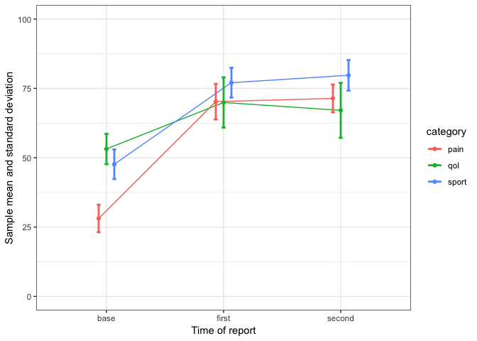

Activity for Lab 2
================
T.H.

``` r
library(tidyverse)
```

    ## ── Attaching packages ───────────────────────────────────────────────────────────────────────────────────── tidyverse 1.2.1 ──

    ## ✔ ggplot2 3.0.0     ✔ purrr   0.2.5
    ## ✔ tibble  1.4.2     ✔ dplyr   0.7.6
    ## ✔ tidyr   0.8.1     ✔ stringr 1.3.1
    ## ✔ readr   1.1.1     ✔ forcats 0.3.0

    ## ── Conflicts ──────────────────────────────────────────────────────────────────────────────────────── tidyverse_conflicts() ──
    ## ✖ dplyr::filter() masks stats::filter()
    ## ✖ dplyr::lag()    masks stats::lag()

``` r
library(ggplot2)
```

### 1.  Download lab2.csv file:

-   time: base, first, second
-   category: sport (sport activity), qol (quality of life), pain

``` r
lab2 <- read.csv('lab2.csv')
```

### 2.  Make the data tidy
### 3.  Summarize by time and category (mean and standard deviation)

``` r
temp <- lab2 %>%
  gather(key = id, value = case, indexes = 2:10) %>%
  separate(id, into = c("time", "category"), sep = "_") %>%
  group_by(time, category) %>% summarise(Mean = round(mean(case), 2), SD = round(sd(case), 2))

temp %>% head
```

    ## # A tibble: 6 x 4
    ## # Groups:   time [2]
    ##   time  category  Mean    SD
    ##   <chr> <chr>    <dbl> <dbl>
    ## 1 base  pain      28.1  4.96
    ## 2 base  qol       53.2  5.47
    ## 3 base  sport     47.7  5.33
    ## 4 first pain      70.2  6.43
    ## 5 first qol       69.9  9.06
    ## 6 first sport     77.1  5.36

### 4.  Write the R code to recreate the following graph (please note that tick mark labels are changed):

``` r
pd <- position_dodge(.2)

ggplot(temp, aes(x = time, y = Mean, group = category, color = category)) +
  geom_point(position = pd) +
  geom_line(position = pd) +
  geom_errorbar(aes(ymin = Mean - SD, ymax = Mean + SD), width = 0.1, size = 1, position = pd ) +
  theme_bw() +
  labs(x = "Time of report", y = "Sample mean and standard deviation") +
  ylim(0, 100)
```


