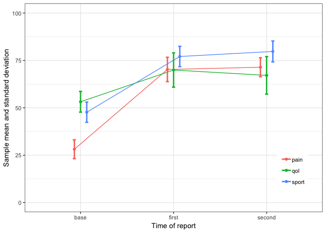

Activity for Lab 2
================
Taehoon Ha
23 September, 2018

``` r
library(tidyverse)
```

    ## ── Attaching packages ──────────────────────────────────────────────────── tidyverse 1.2.1 ──

    ## ✔ ggplot2 3.0.0     ✔ purrr   0.2.5
    ## ✔ tibble  1.4.2     ✔ dplyr   0.7.6
    ## ✔ tidyr   0.8.1     ✔ stringr 1.3.1
    ## ✔ readr   1.1.1     ✔ forcats 0.3.0

    ## ── Conflicts ─────────────────────────────────────────────────────── tidyverse_conflicts() ──
    ## ✖ dplyr::filter() masks stats::filter()
    ## ✖ dplyr::lag()    masks stats::lag()

``` r
library(ggplot2)
```

### 1. Downlad lab2.csv file:

-   time: base, first, second
-   category: sport (sport activity), qol (quality of life), pain

``` r
lab2 <- read.csv('lab2.csv')
```

### 2. Make the data tidy.

``` r
df <- lab2 %>%
  gather(key = id, value = case, indexes = 2:10) %>%
  separate(id, into = c("time", "category"), sep = "_")

df %>% head
```

    ##   patient_id time category case
    ## 1          1 base    sport   47
    ## 2          2 base    sport   53
    ## 3          3 base    sport   42
    ## 4          4 base    sport   57
    ## 5          5 base    sport   42
    ## 6          6 base    sport   58

### 3. Summarize by time and category (mean and standard deviation)

``` r
df <- df %>% 
  group_by(time, category) %>%
  summarise(Mean = round(mean(case), 2), SD = round(sd(case), 2))

df
```

    ## # A tibble: 9 x 4
    ## # Groups:   time [?]
    ##   time   category  Mean    SD
    ##   <chr>  <chr>    <dbl> <dbl>
    ## 1 base   pain      28.1  4.96
    ## 2 base   qol       53.2  5.47
    ## 3 base   sport     47.7  5.33
    ## 4 first  pain      70.2  6.43
    ## 5 first  qol       69.9  9.06
    ## 6 first  sport     77.1  5.36
    ## 7 second pain      71.4  4.99
    ## 8 second qol       67.1  9.9 
    ## 9 second sport     79.7  5.51

### 4. Write the R code to recreate the following graph (please note that tick mark labels are changed):

``` r
pd <- position_dodge(.2)

ggplot(df, aes(x = time, y = Mean, group = category, color = category)) +
  geom_point(position = pd) +
  geom_line(position = pd) +
  geom_errorbar(aes(ymin = df$Mean - df$SD, ymax = df$Mean + df$SD), width = 0.1, size = 1, position = pd ) +
  theme_bw() +
  labs(x = "Time of report", y = "Sample mean and standard deviation") +
  ylim(0, 100) +
  theme(legend.position = c(0.9, 0.2))
```


