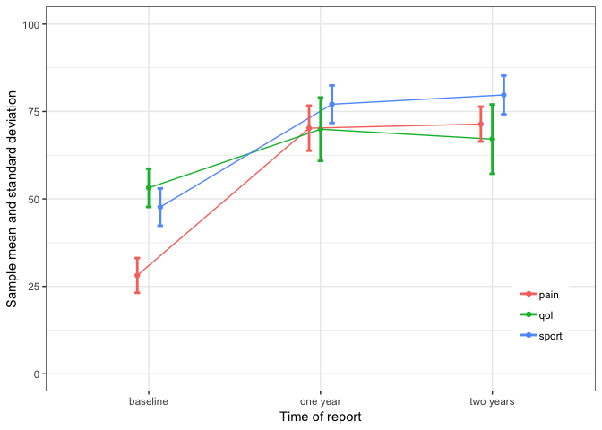

Assignment Two for Lab 2
================
Taehoon Ha
09/23/2018

### 1. Read Chapters 3, 5, 12, 13 from "R for data science" (online version).

### 2. Create a GitHub repository Lab2 (files with R code for this assignment should be added to this repository, do not push csv files for Problem 4 to the GitHub repo).

### 3. Write the R code to recreate the graph from the Activity 2 (Problem 4).

#### 3.1 Downlad lab2.csv file:

-   time: base, first, second
-   category: sport (sport activity), qol (quality of life), pain

``` r
library(tidyverse)
```

    ## ── Attaching packages ────────────────────────────────────────────────────────────── tidyverse 1.2.1 ──

    ## ✔ ggplot2 3.0.0     ✔ purrr   0.2.5
    ## ✔ tibble  1.4.2     ✔ dplyr   0.7.6
    ## ✔ tidyr   0.8.1     ✔ stringr 1.3.1
    ## ✔ readr   1.1.1     ✔ forcats 0.3.0

    ## ── Conflicts ───────────────────────────────────────────────────────────────── tidyverse_conflicts() ──
    ## ✖ dplyr::filter() masks stats::filter()
    ## ✖ dplyr::lag()    masks stats::lag()

``` r
library(ggplot2)

lab2 <- read.csv('lab2.csv')
```

#### 3.2 Make the data tidy.

``` r
df <- lab2 %>%
  gather(key = time_category, value = case, indexes = 2:10) %>%
  separate(time_category, into = c("time", "category"), sep = "_") %>%
  mutate(new.time = recode(time, 'base' = 'baseline',
                'first' = 'one year',
                'second' = 'two years')) %>%
  select(patient_id, new.time, category, case)
```

#### 3.3 Summarize by time and category (mean and standard deviation)

``` r
df <- df %>% 
  group_by(new.time, category) %>%
  summarise(Mean = round(mean(case), 2), SD = round(sd(case), 2))

df
```

    ## # A tibble: 9 x 4
    ## # Groups:   new.time [?]
    ##   new.time  category  Mean    SD
    ##   <chr>     <chr>    <dbl> <dbl>
    ## 1 baseline  pain      28.1  4.96
    ## 2 baseline  qol       53.2  5.47
    ## 3 baseline  sport     47.7  5.33
    ## 4 one year  pain      70.2  6.43
    ## 5 one year  qol       69.9  9.06
    ## 6 one year  sport     77.1  5.36
    ## 7 two years pain      71.4  4.99
    ## 8 two years qol       67.1  9.9 
    ## 9 two years sport     79.7  5.51

#### 3.4 Write the R code to recreate the following graph (please note that tick mark labels are changed):

``` r
pd <- position_dodge(.2)

ggplot(df, aes(x = new.time, y = Mean, group = category, color = category)) +
  geom_point(position = pd) +
  geom_line(position = pd) +
  geom_errorbar(aes(ymin = df$Mean - df$SD, ymax = df$Mean + df$SD), width = 0.1, size = 1, position = pd ) +
  theme_bw() +
  labs(x = "Time of report", y = "Sample mean and standard deviation") +
  ylim(0, 100) +
  theme(legend.position = c(0.9, 0.2), legend.title = element_blank())
```



### 4. Download two files:

-   **coverage.csv** - Health Insurance Coverage of the Total Population (2013 - 2016)
-   **expenditures.csv** - Health Care Expenditures by State of Residence (in millions)

``` r
coverage <- read.csv('coverage.csv', skip = 2, nrows = 52, header = T, sep = ',', stringsAsFactors = F)

expenditures <- read.csv('expenditures.csv', skip = 2, nrows = 52, header = T, sep = ',', stringsAsFactors = F)
```

#### 4.1 Make the data frames "tidy."

``` r
tidy.coverage <- coverage %>% 
  gather(key = XYear__InsType, value = Counts, indexes = 2:ncol(coverage)) %>%
  separate(XYear__InsType, into = c("XYear", "InsType"), sep = '__') %>%
  mutate(Year = gsub("X","", XYear)) %>%
  select(Location, Year, InsType, Counts)

tidy.coverage %>% head
```

    ##        Location Year  InsType    Counts
    ## 1 United States 2013 Employer 155696900
    ## 2       Alabama 2013 Employer   2126500
    ## 3        Alaska 2013 Employer    364900
    ## 4       Arizona 2013 Employer   2883800
    ## 5      Arkansas 2013 Employer   1128800
    ## 6    California 2013 Employer  17747300

``` r
tidy.expenditures <- expenditures %>% 
  gather(XYear__Total.Health.Spending, value = Total.Spent, indexes = 2:ncol(expenditures)) %>%
  separate(XYear__Total.Health.Spending, into = c("XYear", "Category"), sep = '__') %>%
  mutate(Year = gsub("X","", XYear)) %>%
  select(Location, Year, Total.Spent)

tidy.expenditures %>% head
```

    ##        Location Year Total.Spent
    ## 1 United States 1991      675896
    ## 2       Alabama 1991       10393
    ## 3        Alaska 1991        1458
    ## 4       Arizona 1991        9269
    ## 5      Arkansas 1991        5632
    ## 6    California 1991       81438

#### 4.2 Merge two data frames: the resulting data frame should contain information about coverage and expenditures for years 2013-2016. Please note that file **expenditures.csv** does not contain years 2015-2016.

``` r
merge(tidy.coverage, tidy.expenditures, by = c("Location", "Year"), all = T) %>%
  filter(Year >= 2013 & Year <= 2016)
```

    ##                  Location Year      InsType    Counts Total.Spent
    ## 1                 Alabama 2013    Uninsured    724800       33788
    ## 2                 Alabama 2013     Medicare    783000       33788
    ## 3                 Alabama 2013     Employer   2126500       33788
    ## 4                 Alabama 2013        Total   4763900       33788
    ## 5                 Alabama 2013 Other.Public     85600       33788
    ## 6                 Alabama 2013    Non.Group    174200       33788
    ## 7                 Alabama 2013     Medicaid    869700       33788
    ## 8                 Alabama 2014    Uninsured    522200       35263
    ## 9                 Alabama 2014     Medicare    718400       35263
    ## 10                Alabama 2014     Employer   2202800       35263
    ## 11                Alabama 2014        Total   4768000       35263
    ## 12                Alabama 2014 Other.Public    143900       35263
    ## 13                Alabama 2014    Non.Group    288900       35263
    ## 14                Alabama 2014     Medicaid    891900       35263
    ## 15                Alabama 2015     Employer   2218000          NA
    ## 16                Alabama 2015    Non.Group    291500          NA
    ## 17                Alabama 2015     Medicaid    911400          NA
    ## 18                Alabama 2015     Medicare    719100          NA
    ## 19                Alabama 2015 Other.Public    174600          NA
    ## 20                Alabama 2015    Uninsured    519400          NA
    ## 21                Alabama 2015        Total   4833900          NA
    ## 22                Alabama 2016     Employer   2263800          NA
    ## 23                Alabama 2016    Non.Group    262400          NA
    ## 24                Alabama 2016     Medicaid    997000          NA
    ## 25                Alabama 2016     Medicare    761200          NA
    ## 26                Alabama 2016 Other.Public    128800          NA
    ## 27                Alabama 2016    Uninsured    420800          NA
    ## 28                Alabama 2016        Total   4834100          NA
    ## 29                 Alaska 2013        Total    702000        7684
    ## 30                 Alaska 2013     Employer    364900        7684
    ## 31                 Alaska 2013    Uninsured    102200        7684
    ## 32                 Alaska 2013    Non.Group     24000        7684
    ## 33                 Alaska 2013     Medicare     55200        7684
    ## 34                 Alaska 2013 Other.Public     60600        7684
    ## 35                 Alaska 2013     Medicaid     95000        7684
    ## 36                 Alaska 2014        Total    695700        8151
    ## 37                 Alaska 2014     Employer    345300        8151
    ## 38                 Alaska 2014    Uninsured    100800        8151
    ## 39                 Alaska 2014    Non.Group     26800        8151
    ## 40                 Alaska 2014     Medicare     55300        8151
    ## 41                 Alaska 2014 Other.Public     37300        8151
    ## 42                 Alaska 2014     Medicaid    130100        8151
    ## 43                 Alaska 2015     Employer    355700          NA
    ## 44                 Alaska 2015    Non.Group     22300          NA
    ## 45                 Alaska 2015     Medicaid    128100          NA
    ## 46                 Alaska 2015     Medicare     60900          NA
    ## 47                 Alaska 2015 Other.Public     47700          NA
    ## 48                 Alaska 2015    Uninsured     90500          NA
    ## 49                 Alaska 2015        Total    705300          NA
    ## 50                 Alaska 2016     Employer    324400          NA
    ## 51                 Alaska 2016    Non.Group     20300          NA
    ## 52                 Alaska 2016     Medicaid    145400          NA
    ## 53                 Alaska 2016     Medicare     68200          NA
    ## 54                 Alaska 2016 Other.Public     55600          NA
    ## 55                 Alaska 2016    Uninsured     96900          NA
    ## 56                 Alaska 2016        Total    710800          NA
    ## 57                Arizona 2013     Employer   2883800       41481
    ## 58                Arizona 2013    Non.Group    170800       41481
    ## 59                Arizona 2013    Uninsured   1223000       41481
    ## 60                Arizona 2013 Other.Public       N/A       41481
    ## 61                Arizona 2013        Total   6603100       41481
    ## 62                Arizona 2013     Medicaid   1346100       41481
    ## 63                Arizona 2013     Medicare    842000       41481
    ## 64                Arizona 2014     Employer   2835200       43356
    ## 65                Arizona 2014    Non.Group    333500       43356
    ## 66                Arizona 2014    Uninsured    827100       43356
    ## 67                Arizona 2014 Other.Public       N/A       43356
    ## 68                Arizona 2014        Total   6657200       43356
    ## 69                Arizona 2014     Medicaid   1639400       43356
    ## 70                Arizona 2014     Medicare    911100       43356
    ## 71                Arizona 2015     Employer   2766500          NA
    ## 72                Arizona 2015    Non.Group    278400          NA
    ## 73                Arizona 2015     Medicaid   1711500          NA
    ## 74                Arizona 2015     Medicare    949000          NA
    ## 75                Arizona 2015 Other.Public    189300          NA
    ## 76                Arizona 2015    Uninsured    844800          NA
    ## 77                Arizona 2015        Total   6739500          NA
    ## 78                Arizona 2016     Employer   3010700          NA
    ## 79                Arizona 2016    Non.Group    377000          NA
    ## 80                Arizona 2016     Medicaid   1468400          NA
    ## 81                Arizona 2016     Medicare   1028000          NA
    ## 82                Arizona 2016 Other.Public    172500          NA
    ## 83                Arizona 2016    Uninsured    833700          NA
    ## 84                Arizona 2016        Total   6890200          NA
    ## 85               Arkansas 2013    Non.Group    155600       20500
    ## 86               Arkansas 2013     Medicaid    600800       20500
    ## 87               Arkansas 2013     Employer   1128800       20500
    ## 88               Arkansas 2013    Uninsured    436800       20500
    ## 89               Arkansas 2013 Other.Public     67600       20500
    ## 90               Arkansas 2013        Total   2904800       20500
    ## 91               Arkansas 2013     Medicare    515200       20500
    ## 92               Arkansas 2014    Non.Group    231700       21980
    ## 93               Arkansas 2014     Medicaid    639200       21980
    ## 94               Arkansas 2014     Employer   1176500       21980
    ## 95               Arkansas 2014    Uninsured    287200       21980
    ## 96               Arkansas 2014 Other.Public     82000       21980
    ## 97               Arkansas 2014        Total   2896000       21980
    ## 98               Arkansas 2014     Medicare    479400       21980
    ## 99               Arkansas 2015     Employer   1293700          NA
    ## 100              Arkansas 2015    Non.Group    200200          NA
    ## 101              Arkansas 2015     Medicaid    641400          NA
    ## 102              Arkansas 2015     Medicare    484500          NA
    ## 103              Arkansas 2015 Other.Public     63700          NA
    ## 104              Arkansas 2015    Uninsured    268400          NA
    ## 105              Arkansas 2015        Total   2953000          NA
    ## 106              Arkansas 2016     Employer   1290900          NA
    ## 107              Arkansas 2016    Non.Group    252900          NA
    ## 108              Arkansas 2016     Medicaid    618600          NA
    ## 109              Arkansas 2016     Medicare    490000          NA
    ## 110              Arkansas 2016 Other.Public     67500          NA
    ## 111              Arkansas 2016    Uninsured    225500          NA
    ## 112              Arkansas 2016        Total   2945300          NA
    ## 113            California 2013    Uninsured   5594100      278168
    ## 114            California 2013     Medicare   3828500      278168
    ## 115            California 2013     Medicaid   8344800      278168
    ## 116            California 2013    Non.Group   1986400      278168
    ## 117            California 2013     Employer  17747300      278168
    ## 118            California 2013 Other.Public    675400      278168
    ## 119            California 2013        Total  38176400      278168
    ## 120            California 2014    Uninsured   3916700      291989
    ## 121            California 2014     Medicare   4049000      291989
    ## 122            California 2014     Medicaid   9618800      291989
    ## 123            California 2014    Non.Group   2778800      291989
    ## 124            California 2014     Employer  17703700      291989
    ## 125            California 2014 Other.Public    634400      291989
    ## 126            California 2014        Total  38701300      291989
    ## 127            California 2015     Employer  17718300          NA
    ## 128            California 2015    Non.Group   3444200          NA
    ## 129            California 2015     Medicaid  10138100          NA
    ## 130            California 2015     Medicare   4080100          NA
    ## 131            California 2015 Other.Public    752700          NA
    ## 132            California 2015    Uninsured   2980600          NA
    ## 133            California 2015        Total  39113900          NA
    ## 134            California 2016     Employer  18116200          NA
    ## 135            California 2016    Non.Group   3195400          NA
    ## 136            California 2016     Medicaid   9853800          NA
    ## 137            California 2016     Medicare   4436000          NA
    ## 138            California 2016 Other.Public    556100          NA
    ## 139            California 2016    Uninsured   3030800          NA
    ## 140            California 2016        Total  39188300          NA
    ## 141              Colorado 2013        Total   5297800       34090
    ## 142              Colorado 2013    Uninsured    654000       34090
    ## 143              Colorado 2013     Employer   2852500       34090
    ## 144              Colorado 2013     Medicare    549700       34090
    ## 145              Colorado 2013     Medicaid    697300       34090
    ## 146              Colorado 2013    Non.Group    426300       34090
    ## 147              Colorado 2013 Other.Public    118100       34090
    ## 148              Colorado 2014        Total   5377400       36398
    ## 149              Colorado 2014    Uninsured    602900       36398
    ## 150              Colorado 2014     Employer   2489400       36398
    ## 151              Colorado 2014     Medicare    619500       36398
    ## 152              Colorado 2014     Medicaid   1053700       36398
    ## 153              Colorado 2014    Non.Group    397900       36398
    ## 154              Colorado 2014 Other.Public    214000       36398
    ## 155              Colorado 2015     Employer   2706000          NA
    ## 156              Colorado 2015    Non.Group    346900          NA
    ## 157              Colorado 2015     Medicaid   1036600          NA
    ## 158              Colorado 2015     Medicare    708000          NA
    ## 159              Colorado 2015 Other.Public    148000          NA
    ## 160              Colorado 2015    Uninsured    475700          NA
    ## 161              Colorado 2015        Total   5421300          NA
    ## 162              Colorado 2016     Employer   2872600          NA
    ## 163              Colorado 2016    Non.Group    370000          NA
    ## 164              Colorado 2016     Medicaid    855800          NA
    ## 165              Colorado 2016     Medicare    692400          NA
    ## 166              Colorado 2016 Other.Public    190100          NA
    ## 167              Colorado 2016    Uninsured    528400          NA
    ## 168              Colorado 2016        Total   5509200          NA
    ## 169           Connecticut 2013     Medicare    475300       34223
    ## 170           Connecticut 2013     Employer   2030500       34223
    ## 171           Connecticut 2013    Non.Group    126800       34223
    ## 172           Connecticut 2013        Total   3578900       34223
    ## 173           Connecticut 2013 Other.Public     48200       34223
    ## 174           Connecticut 2013    Uninsured    366100       34223
    ## 175           Connecticut 2013     Medicaid    532000       34223
    ## 176           Connecticut 2014     Medicare    435400       35413
    ## 177           Connecticut 2014     Employer   2086800       35413
    ## 178           Connecticut 2014    Non.Group    223500       35413
    ## 179           Connecticut 2014        Total   3577900       35413
    ## 180           Connecticut 2014 Other.Public     40900       35413
    ## 181           Connecticut 2014    Uninsured    249200       35413
    ## 182           Connecticut 2014     Medicaid    542000       35413
    ## 183           Connecticut 2015     Employer   1857800          NA
    ## 184           Connecticut 2015    Non.Group    302700          NA
    ## 185           Connecticut 2015     Medicaid    690400          NA
    ## 186           Connecticut 2015     Medicare    474700          NA
    ## 187           Connecticut 2015 Other.Public       N/A          NA
    ## 188           Connecticut 2015    Uninsured    216900          NA
    ## 189           Connecticut 2015        Total   3571700          NA
    ## 190           Connecticut 2016     Employer   1926900          NA
    ## 191           Connecticut 2016    Non.Group    200700          NA
    ## 192           Connecticut 2016     Medicaid    711200          NA
    ## 193           Connecticut 2016     Medicare    483300          NA
    ## 194           Connecticut 2016 Other.Public       N/A          NA
    ## 195           Connecticut 2016    Uninsured    218600          NA
    ## 196           Connecticut 2016        Total   3570300          NA
    ## 197              Delaware 2013     Medicare    141300        9038
    ## 198              Delaware 2013 Other.Public     13800        9038
    ## 199              Delaware 2013     Employer    473700        9038
    ## 200              Delaware 2013     Medicaid    192700        9038
    ## 201              Delaware 2013    Non.Group     25100        9038
    ## 202              Delaware 2013    Uninsured     62700        9038
    ## 203              Delaware 2013        Total    909300        9038
    ## 204              Delaware 2014     Medicare    141100        9587
    ## 205              Delaware 2014 Other.Public     30700        9587
    ## 206              Delaware 2014     Employer    488100        9587
    ## 207              Delaware 2014     Medicaid    167200        9587
    ## 208              Delaware 2014    Non.Group     39200        9587
    ## 209              Delaware 2014    Uninsured     63000        9587
    ## 210              Delaware 2014        Total    929500        9587
    ## 211              Delaware 2015     Employer    505800          NA
    ## 212              Delaware 2015    Non.Group     48600          NA
    ## 213              Delaware 2015     Medicaid    174700          NA
    ## 214              Delaware 2015     Medicare    138200          NA
    ## 215              Delaware 2015 Other.Public     26500          NA
    ## 216              Delaware 2015    Uninsured     65300          NA
    ## 217              Delaware 2015        Total    959100          NA
    ## 218              Delaware 2016     Employer    445500          NA
    ## 219              Delaware 2016    Non.Group     36200          NA
    ## 220              Delaware 2016     Medicaid    211900          NA
    ## 221              Delaware 2016     Medicare    152000          NA
    ## 222              Delaware 2016 Other.Public     18600          NA
    ## 223              Delaware 2016    Uninsured     84100          NA
    ## 224              Delaware 2016        Total    948200          NA
    ## 225  District of Columbia 2013     Medicare     59900        7443
    ## 226  District of Columbia 2013    Uninsured     51100        7443
    ## 227  District of Columbia 2013 Other.Public       N/A        7443
    ## 228  District of Columbia 2013    Non.Group     30400        7443
    ## 229  District of Columbia 2013        Total    652100        7443
    ## 230  District of Columbia 2013     Medicaid    174900        7443
    ## 231  District of Columbia 2013     Employer    324300        7443
    ## 232  District of Columbia 2014     Medicare     51900        7871
    ## 233  District of Columbia 2014    Uninsured     42300        7871
    ## 234  District of Columbia 2014 Other.Public       N/A        7871
    ## 235  District of Columbia 2014    Non.Group     39900        7871
    ## 236  District of Columbia 2014        Total    656900        7871
    ## 237  District of Columbia 2014     Medicaid    162600        7871
    ## 238  District of Columbia 2014     Employer    354100        7871
    ## 239  District of Columbia 2015     Employer    349900          NA
    ## 240  District of Columbia 2015    Non.Group     53500          NA
    ## 241  District of Columbia 2015     Medicaid    175400          NA
    ## 242  District of Columbia 2015     Medicare     66400          NA
    ## 243  District of Columbia 2015 Other.Public       N/A          NA
    ## 244  District of Columbia 2015    Uninsured     27200          NA
    ## 245  District of Columbia 2015        Total    676800          NA
    ## 246  District of Columbia 2016     Employer    351800          NA
    ## 247  District of Columbia 2016    Non.Group     48100          NA
    ## 248  District of Columbia 2016     Medicaid    166000          NA
    ## 249  District of Columbia 2016     Medicare     76000          NA
    ## 250  District of Columbia 2016 Other.Public       N/A          NA
    ## 251  District of Columbia 2016    Uninsured     35400          NA
    ## 252  District of Columbia 2016        Total    685800          NA
    ## 253               Florida 2013    Uninsured   3619700      150547
    ## 254               Florida 2013     Employer   8023400      150547
    ## 255               Florida 2013        Total  19429000      150547
    ## 256               Florida 2013 Other.Public    517800      150547
    ## 257               Florida 2013     Medicare   3108800      150547
    ## 258               Florida 2013     Medicaid   3190900      150547
    ## 259               Florida 2013    Non.Group    968200      150547
    ## 260               Florida 2014    Uninsured   2874800      160624
    ## 261               Florida 2014     Employer   7731600      160624
    ## 262               Florida 2014        Total  19731100      160624
    ## 263               Florida 2014 Other.Public    473300      160624
    ## 264               Florida 2014     Medicare   3324700      160624
    ## 265               Florida 2014     Medicaid   3755500      160624
    ## 266               Florida 2014    Non.Group   1563400      160624
    ## 267               Florida 2015     Employer   7879800          NA
    ## 268               Florida 2015    Non.Group   1949500          NA
    ## 269               Florida 2015     Medicaid   3610400          NA
    ## 270               Florida 2015     Medicare   3535600          NA
    ## 271               Florida 2015 Other.Public    563200          NA
    ## 272               Florida 2015    Uninsured   2544700          NA
    ## 273               Florida 2015        Total  20085300          NA
    ## 274               Florida 2016     Employer   8602700          NA
    ## 275               Florida 2016    Non.Group   2061400          NA
    ## 276               Florida 2016     Medicaid   3294400          NA
    ## 277               Florida 2016     Medicare   3602900          NA
    ## 278               Florida 2016 Other.Public    518200          NA
    ## 279               Florida 2016    Uninsured   2465800          NA
    ## 280               Florida 2016        Total  20545300          NA
    ## 281               Georgia 2013    Uninsured   1592800       62399
    ## 282               Georgia 2013     Medicare   1280400       62399
    ## 283               Georgia 2013     Employer   4700500       62399
    ## 284               Georgia 2013    Non.Group    401600       62399
    ## 285               Georgia 2013        Total   9813000       62399
    ## 286               Georgia 2013 Other.Public    334700       62399
    ## 287               Georgia 2013     Medicaid   1503000       62399
    ## 288               Georgia 2014    Uninsured   1546500       66447
    ## 289               Georgia 2014     Medicare   1230400       66447
    ## 290               Georgia 2014     Employer   4697300       66447
    ## 291               Georgia 2014    Non.Group    551200       66447
    ## 292               Georgia 2014        Total   9965100       66447
    ## 293               Georgia 2014 Other.Public    296700       66447
    ## 294               Georgia 2014     Medicaid   1643000       66447
    ## 295               Georgia 2015     Employer   4649000          NA
    ## 296               Georgia 2015    Non.Group    583200          NA
    ## 297               Georgia 2015     Medicaid   1914400          NA
    ## 298               Georgia 2015     Medicare   1271300          NA
    ## 299               Georgia 2015 Other.Public    275800          NA
    ## 300               Georgia 2015    Uninsured   1411000          NA
    ## 301               Georgia 2015        Total  10104900          NA
    ## 302               Georgia 2016     Employer   5038000          NA
    ## 303               Georgia 2016    Non.Group    695300          NA
    ## 304               Georgia 2016     Medicaid   1708000          NA
    ## 305               Georgia 2016     Medicare   1213800          NA
    ## 306               Georgia 2016 Other.Public    360000          NA
    ## 307               Georgia 2016    Uninsured   1265600          NA
    ## 308               Georgia 2016        Total  10280800          NA
    ## 309                Hawaii 2013        Total   1355600        9781
    ## 310                Hawaii 2013     Medicare    195000        9781
    ## 311                Hawaii 2013    Uninsured     68600        9781
    ## 312                Hawaii 2013 Other.Public     78600        9781
    ## 313                Hawaii 2013    Non.Group     47900        9781
    ## 314                Hawaii 2013     Employer    732600        9781
    ## 315                Hawaii 2013     Medicaid    232600        9781
    ## 316                Hawaii 2014        Total   1365400       10338
    ## 317                Hawaii 2014     Medicare    205500       10338
    ## 318                Hawaii 2014    Uninsured     72800       10338
    ## 319                Hawaii 2014 Other.Public     89900       10338
    ## 320                Hawaii 2014    Non.Group     44000       10338
    ## 321                Hawaii 2014     Employer    724800       10338
    ## 322                Hawaii 2014     Medicaid    228300       10338
    ## 323                Hawaii 2015     Employer    720000          NA
    ## 324                Hawaii 2015    Non.Group     38300          NA
    ## 325                Hawaii 2015     Medicaid    243800          NA
    ## 326                Hawaii 2015     Medicare    207100          NA
    ## 327                Hawaii 2015 Other.Public    106500          NA
    ## 328                Hawaii 2015    Uninsured     70300          NA
    ## 329                Hawaii 2015        Total   1386000          NA
    ## 330                Hawaii 2016     Employer    771400          NA
    ## 331                Hawaii 2016    Non.Group     47500          NA
    ## 332                Hawaii 2016     Medicaid    207900          NA
    ## 333                Hawaii 2016     Medicare    210200          NA
    ## 334                Hawaii 2016 Other.Public     80400          NA
    ## 335                Hawaii 2016    Uninsured     75000          NA
    ## 336                Hawaii 2016        Total   1392400          NA
    ## 337                 Idaho 2013        Total   1600600       10627
    ## 338                 Idaho 2013     Medicare    194600       10627
    ## 339                 Idaho 2013     Employer    802200       10627
    ## 340                 Idaho 2013    Uninsured    235000       10627
    ## 341                 Idaho 2013 Other.Public     21500       10627
    ## 342                 Idaho 2013    Non.Group    114100       10627
    ## 343                 Idaho 2013     Medicaid    233200       10627
    ## 344                 Idaho 2014        Total   1610200       11315
    ## 345                 Idaho 2014     Medicare    181900       11315
    ## 346                 Idaho 2014     Employer    825700       11315
    ## 347                 Idaho 2014    Uninsured    169800       11315
    ## 348                 Idaho 2014 Other.Public     37300       11315
    ## 349                 Idaho 2014    Non.Group    126900       11315
    ## 350                 Idaho 2014     Medicaid    268600       11315
    ## 351                 Idaho 2015     Employer    798000          NA
    ## 352                 Idaho 2015    Non.Group    124600          NA
    ## 353                 Idaho 2015     Medicaid    292700          NA
    ## 354                 Idaho 2015     Medicare    232500          NA
    ## 355                 Idaho 2015 Other.Public     24200          NA
    ## 356                 Idaho 2015    Uninsured    187500          NA
    ## 357                 Idaho 2015        Total   1659500          NA
    ## 358                 Idaho 2016     Employer    811900          NA
    ## 359                 Idaho 2016    Non.Group    164600          NA
    ## 360                 Idaho 2016     Medicaid    293500          NA
    ## 361                 Idaho 2016     Medicare    229500          NA
    ## 362                 Idaho 2016 Other.Public     32500          NA
    ## 363                 Idaho 2016    Uninsured    147100          NA
    ## 364                 Idaho 2016        Total   1679000          NA
    ## 365              Illinois 2013    Uninsured   1335800      101891
    ## 366              Illinois 2013     Employer   6768200      101891
    ## 367              Illinois 2013        Total  12769500      101891
    ## 368              Illinois 2013     Medicare   1539500      101891
    ## 369              Illinois 2013 Other.Public    110200      101891
    ## 370              Illinois 2013    Non.Group    636900      101891
    ## 371              Illinois 2013     Medicaid   2379100      101891
    ## 372              Illinois 2014    Uninsured   1141300      106306
    ## 373              Illinois 2014     Employer   6629700      106306
    ## 374              Illinois 2014        Total  12797900      106306
    ## 375              Illinois 2014     Medicare   1754400      106306
    ## 376              Illinois 2014 Other.Public    114400      106306
    ## 377              Illinois 2014    Non.Group    722000      106306
    ## 378              Illinois 2014     Medicaid   2436100      106306
    ## 379              Illinois 2015     Employer   6842600          NA
    ## 380              Illinois 2015    Non.Group    812600          NA
    ## 381              Illinois 2015     Medicaid   2405700          NA
    ## 382              Illinois 2015     Medicare   1741700          NA
    ## 383              Illinois 2015 Other.Public    106900          NA
    ## 384              Illinois 2015    Uninsured    792300          NA
    ## 385              Illinois 2015        Total  12701800          NA
    ## 386              Illinois 2016     Employer   6491400          NA
    ## 387              Illinois 2016    Non.Group    965000          NA
    ## 388              Illinois 2016     Medicaid   2321100          NA
    ## 389              Illinois 2016     Medicare   1761300          NA
    ## 390              Illinois 2016 Other.Public    137600          NA
    ## 391              Illinois 2016    Uninsured    931100          NA
    ## 392              Illinois 2016        Total  12607400          NA
    ## 393               Indiana 2013     Employer   3494600       52046
    ## 394               Indiana 2013     Medicare    830300       52046
    ## 395               Indiana 2013    Non.Group    234300       52046
    ## 396               Indiana 2013    Uninsured    814200       52046
    ## 397               Indiana 2013        Total   6471300       52046
    ## 398               Indiana 2013 Other.Public     91700       52046
    ## 399               Indiana 2013     Medicaid   1006200       52046
    ## 400               Indiana 2014     Employer   3296700       54741
    ## 401               Indiana 2014     Medicare    980700       54741
    ## 402               Indiana 2014    Non.Group    341100       54741
    ## 403               Indiana 2014    Uninsured    687900       54741
    ## 404               Indiana 2014        Total   6477500       54741
    ## 405               Indiana 2014 Other.Public       N/A       54741
    ## 406               Indiana 2014     Medicaid   1095800       54741
    ## 407               Indiana 2015     Employer   3383600          NA
    ## 408               Indiana 2015    Non.Group    317100          NA
    ## 409               Indiana 2015     Medicaid   1218500          NA
    ## 410               Indiana 2015     Medicare    906800          NA
    ## 411               Indiana 2015 Other.Public     74900          NA
    ## 412               Indiana 2015    Uninsured    611000          NA
    ## 413               Indiana 2015        Total   6512100          NA
    ## 414               Indiana 2016     Employer   3379100          NA
    ## 415               Indiana 2016    Non.Group     4e+05          NA
    ## 416               Indiana 2016     Medicaid   1279300          NA
    ## 417               Indiana 2016     Medicare    922500          NA
    ## 418               Indiana 2016 Other.Public     94300          NA
    ## 419               Indiana 2016    Uninsured    428100          NA
    ## 420               Indiana 2016        Total   6503200          NA
    ## 421                  Iowa 2013     Employer   1743100       24135
    ## 422                  Iowa 2013    Non.Group    168800       24135
    ## 423                  Iowa 2013        Total   3077400       24135
    ## 424                  Iowa 2013     Medicare    404100       24135
    ## 425                  Iowa 2013    Uninsured    250800       24135
    ## 426                  Iowa 2013 Other.Public     46600       24135
    ## 427                  Iowa 2013     Medicaid    464000       24135
    ## 428                  Iowa 2014     Employer   1643600       25487
    ## 429                  Iowa 2014    Non.Group    237400       25487
    ## 430                  Iowa 2014        Total   3080800       25487
    ## 431                  Iowa 2014     Medicare    443500       25487
    ## 432                  Iowa 2014    Uninsured    191800       25487
    ## 433                  Iowa 2014 Other.Public     51600       25487
    ## 434                  Iowa 2014     Medicaid    512900       25487
    ## 435                  Iowa 2015     Employer   1641000          NA
    ## 436                  Iowa 2015    Non.Group    249700          NA
    ## 437                  Iowa 2015     Medicaid    538700          NA
    ## 438                  Iowa 2015     Medicare    459600          NA
    ## 439                  Iowa 2015 Other.Public     45000          NA
    ## 440                  Iowa 2015    Uninsured    166700          NA
    ## 441                  Iowa 2015        Total   3100600          NA
    ## 442                  Iowa 2016     Employer   1690700          NA
    ## 443                  Iowa 2016    Non.Group    191800          NA
    ## 444                  Iowa 2016     Medicaid    571300          NA
    ## 445                  Iowa 2016     Medicare    459800          NA
    ## 446                  Iowa 2016 Other.Public     30200          NA
    ## 447                  Iowa 2016    Uninsured    162300          NA
    ## 448                  Iowa 2016        Total   3106200          NA
    ## 449                Kansas 2013    Non.Group    127900       21490
    ## 450                Kansas 2013     Employer   1530500       21490
    ## 451                Kansas 2013     Medicaid    414600       21490
    ## 452                Kansas 2013    Uninsured    283000       21490
    ## 453                Kansas 2013        Total   2817600       21490
    ## 454                Kansas 2013     Medicare    364900       21490
    ## 455                Kansas 2013 Other.Public       N/A       21490
    ## 456                Kansas 2014    Non.Group    167000       22183
    ## 457                Kansas 2014     Employer   1495700       22183
    ## 458                Kansas 2014     Medicaid    430100       22183
    ## 459                Kansas 2014    Uninsured    307400       22183
    ## 460                Kansas 2014        Total   2853000       22183
    ## 461                Kansas 2014     Medicare    373100       22183
    ## 462                Kansas 2014 Other.Public       N/A       22183
    ## 463                Kansas 2015     Employer   1542700          NA
    ## 464                Kansas 2015    Non.Group    206900          NA
    ## 465                Kansas 2015     Medicaid    384300          NA
    ## 466                Kansas 2015     Medicare    370600          NA
    ## 467                Kansas 2015 Other.Public     62600          NA
    ## 468                Kansas 2015    Uninsured    285300          NA
    ## 469                Kansas 2015        Total   2852400          NA
    ## 470                Kansas 2016     Employer   1506300          NA
    ## 471                Kansas 2016    Non.Group    246300          NA
    ## 472                Kansas 2016     Medicaid    412200          NA
    ## 473                Kansas 2016     Medicare    380200          NA
    ## 474                Kansas 2016 Other.Public       N/A          NA
    ## 475                Kansas 2016    Uninsured    241900          NA
    ## 476                Kansas 2016        Total   2865000          NA
    ## 477              Kentucky 2013    Uninsured    624100       33194
    ## 478              Kentucky 2013     Medicaid    868400       33194
    ## 479              Kentucky 2013    Non.Group    110100       33194
    ## 480              Kentucky 2013     Employer   2076800       33194
    ## 481              Kentucky 2013        Total   4400100       33194
    ## 482              Kentucky 2013     Medicare    604700       33194
    ## 483              Kentucky 2013 Other.Public    116000       33194
    ## 484              Kentucky 2014    Uninsured    289300       35323
    ## 485              Kentucky 2014     Medicaid    987300       35323
    ## 486              Kentucky 2014    Non.Group    271900       35323
    ## 487              Kentucky 2014     Employer   1965500       35323
    ## 488              Kentucky 2014        Total   4315700       35323
    ## 489              Kentucky 2014     Medicare    713800       35323
    ## 490              Kentucky 2014 Other.Public       N/A       35323
    ## 491              Kentucky 2015     Employer   1983800          NA
    ## 492              Kentucky 2015    Non.Group    378100          NA
    ## 493              Kentucky 2015     Medicaid    964400          NA
    ## 494              Kentucky 2015     Medicare    719500          NA
    ## 495              Kentucky 2015 Other.Public       N/A          NA
    ## 496              Kentucky 2015    Uninsured    266900          NA
    ## 497              Kentucky 2015        Total   4383400          NA
    ## 498              Kentucky 2016     Employer   1948800          NA
    ## 499              Kentucky 2016    Non.Group    428000          NA
    ## 500              Kentucky 2016     Medicaid    928000          NA
    ## 501              Kentucky 2016     Medicare    706300          NA
    ## 502              Kentucky 2016 Other.Public       N/A          NA
    ## 503              Kentucky 2016    Uninsured    271400          NA
    ## 504              Kentucky 2016        Total   4388200          NA
    ## 505             Louisiana 2013     Medicaid    900200       34639
    ## 506             Louisiana 2013     Employer   2083400       34639
    ## 507             Louisiana 2013     Medicare    643900       34639
    ## 508             Louisiana 2013    Uninsured    645000       34639
    ## 509             Louisiana 2013    Non.Group    164700       34639
    ## 510             Louisiana 2013        Total   4532300       34639
    ## 511             Louisiana 2013 Other.Public     95100       34639
    ## 512             Louisiana 2014     Medicaid   1036100       36324
    ## 513             Louisiana 2014     Employer   2067300       36324
    ## 514             Louisiana 2014     Medicare    517100       36324
    ## 515             Louisiana 2014    Uninsured    588000       36324
    ## 516             Louisiana 2014    Non.Group    231100       36324
    ## 517             Louisiana 2014        Total   4556500       36324
    ## 518             Louisiana 2014 Other.Public    117000       36324
    ## 519             Louisiana 2015     Employer   2125700          NA
    ## 520             Louisiana 2015    Non.Group    315100          NA
    ## 521             Louisiana 2015     Medicaid    921700          NA
    ## 522             Louisiana 2015     Medicare    615600          NA
    ## 523             Louisiana 2015 Other.Public       N/A          NA
    ## 524             Louisiana 2015    Uninsured    502900          NA
    ## 525             Louisiana 2015        Total   4604200          NA
    ## 526             Louisiana 2016     Employer   1910100          NA
    ## 527             Louisiana 2016    Non.Group    281500          NA
    ## 528             Louisiana 2016     Medicaid   1136600          NA
    ## 529             Louisiana 2016     Medicare    621100          NA
    ## 530             Louisiana 2016 Other.Public       N/A          NA
    ## 531             Louisiana 2016    Uninsured    484500          NA
    ## 532             Louisiana 2016        Total   4578500          NA
    ## 533                 Maine 2013     Medicaid    277200       12139
    ## 534                 Maine 2013     Medicare    195100       12139
    ## 535                 Maine 2013    Non.Group     41300       12139
    ## 536                 Maine 2013     Employer    658200       12139
    ## 537                 Maine 2013        Total   1316500       12139
    ## 538                 Maine 2013 Other.Public     21200       12139
    ## 539                 Maine 2013    Uninsured    123600       12139
    ## 540                 Maine 2014     Medicaid    255400       12684
    ## 541                 Maine 2014     Medicare    213500       12684
    ## 542                 Maine 2014    Non.Group     67000       12684
    ## 543                 Maine 2014     Employer    616000       12684
    ## 544                 Maine 2014        Total   1299600       12684
    ## 545                 Maine 2014 Other.Public     26000       12684
    ## 546                 Maine 2014    Uninsured    121800       12684
    ## 547                 Maine 2015     Employer    634200          NA
    ## 548                 Maine 2015    Non.Group     70100          NA
    ## 549                 Maine 2015     Medicaid    306300          NA
    ## 550                 Maine 2015     Medicare    245600          NA
    ## 551                 Maine 2015 Other.Public     24900          NA
    ## 552                 Maine 2015    Uninsured     60800          NA
    ## 553                 Maine 2015        Total   1341900          NA
    ## 554                 Maine 2016     Employer    645400          NA
    ## 555                 Maine 2016    Non.Group     65600          NA
    ## 556                 Maine 2016     Medicaid    280700          NA
    ## 557                 Maine 2016     Medicare    217100          NA
    ## 558                 Maine 2016 Other.Public     19000          NA
    ## 559                 Maine 2016    Uninsured     93900          NA
    ## 560                 Maine 2016        Total   1321600          NA
    ## 561              Maryland 2013     Medicaid    889800       48929
    ## 562              Maryland 2013     Medicare    751500       48929
    ## 563              Maryland 2013     Employer   3172400       48929
    ## 564              Maryland 2013 Other.Public    124400       48929
    ## 565              Maryland 2013    Non.Group    320800       48929
    ## 566              Maryland 2013    Uninsured    682000       48929
    ## 567              Maryland 2013        Total   5940900       48929
    ## 568              Maryland 2014     Medicaid    807900       51330
    ## 569              Maryland 2014     Medicare    730900       51330
    ## 570              Maryland 2014     Employer   3558800       51330
    ## 571              Maryland 2014 Other.Public    136700       51330
    ## 572              Maryland 2014    Non.Group    361700       51330
    ## 573              Maryland 2014    Uninsured    343000       51330
    ## 574              Maryland 2014        Total   5938900       51330
    ## 575              Maryland 2015     Employer   3431400          NA
    ## 576              Maryland 2015    Non.Group    371400          NA
    ## 577              Maryland 2015     Medicaid    856800          NA
    ## 578              Maryland 2015     Medicare    705500          NA
    ## 579              Maryland 2015 Other.Public    141200          NA
    ## 580              Maryland 2015    Uninsured    394300          NA
    ## 581              Maryland 2015        Total   5900500          NA
    ## 582              Maryland 2016     Employer   3210600          NA
    ## 583              Maryland 2016    Non.Group    443000          NA
    ## 584              Maryland 2016     Medicaid    926300          NA
    ## 585              Maryland 2016     Medicare    827000          NA
    ## 586              Maryland 2016 Other.Public    153800          NA
    ## 587              Maryland 2016    Uninsured    372100          NA
    ## 588              Maryland 2016        Total   5932800          NA
    ## 589         Massachusetts 2013    Uninsured    208700       68899
    ## 590         Massachusetts 2013     Medicare    840800       68899
    ## 591         Massachusetts 2013     Medicaid   1356100       68899
    ## 592         Massachusetts 2013        Total   6647700       68899
    ## 593         Massachusetts 2013 Other.Public       N/A       68899
    ## 594         Massachusetts 2013    Non.Group    289200       68899
    ## 595         Massachusetts 2013     Employer   3908800       68899
    ## 596         Massachusetts 2014    Uninsured    293800       71274
    ## 597         Massachusetts 2014     Medicare    860500       71274
    ## 598         Massachusetts 2014     Medicaid   1570100       71274
    ## 599         Massachusetts 2014        Total   6658100       71274
    ## 600         Massachusetts 2014 Other.Public       N/A       71274
    ## 601         Massachusetts 2014    Non.Group    352200       71274
    ## 602         Massachusetts 2014     Employer   3549900       71274
    ## 603         Massachusetts 2015     Employer   3696000          NA
    ## 604         Massachusetts 2015    Non.Group    368200          NA
    ## 605         Massachusetts 2015     Medicaid   1575800          NA
    ## 606         Massachusetts 2015     Medicare    792600          NA
    ## 607         Massachusetts 2015 Other.Public     64300          NA
    ## 608         Massachusetts 2015    Uninsured    288800          NA
    ## 609         Massachusetts 2015        Total   6785700          NA
    ## 610         Massachusetts 2016     Employer   3666500          NA
    ## 611         Massachusetts 2016    Non.Group    392300          NA
    ## 612         Massachusetts 2016     Medicaid   1473500          NA
    ## 613         Massachusetts 2016     Medicare    797400          NA
    ## 614         Massachusetts 2016 Other.Public     70800          NA
    ## 615         Massachusetts 2016    Uninsured    379100          NA
    ## 616         Massachusetts 2016        Total   6779600          NA
    ## 617              Michigan 2013     Medicaid   1692500       76672
    ## 618              Michigan 2013    Uninsured   1041500       76672
    ## 619              Michigan 2013     Employer   5388000       76672
    ## 620              Michigan 2013     Medicare   1384300       76672
    ## 621              Michigan 2013 Other.Public     68300       76672
    ## 622              Michigan 2013    Non.Group    317800       76672
    ## 623              Michigan 2013        Total   9892400       76672
    ## 624              Michigan 2014     Medicaid   2007900       79874
    ## 625              Michigan 2014    Uninsured    697900       79874
    ## 626              Michigan 2014     Employer   5176600       79874
    ## 627              Michigan 2014     Medicare   1414500       79874
    ## 628              Michigan 2014 Other.Public     53100       79874
    ## 629              Michigan 2014    Non.Group    556400       79874
    ## 630              Michigan 2014        Total   9906400       79874
    ## 631              Michigan 2015     Employer   5185900          NA
    ## 632              Michigan 2015    Non.Group    561800          NA
    ## 633              Michigan 2015     Medicaid   1912700          NA
    ## 634              Michigan 2015     Medicare   1541800          NA
    ## 635              Michigan 2015 Other.Public       N/A          NA
    ## 636              Michigan 2015    Uninsured    571200          NA
    ## 637              Michigan 2015        Total   9862100          NA
    ## 638              Michigan 2016     Employer   5046700          NA
    ## 639              Michigan 2016    Non.Group    456400          NA
    ## 640              Michigan 2016     Medicaid   2168900          NA
    ## 641              Michigan 2016     Medicare   1522400          NA
    ## 642              Michigan 2016 Other.Public     72500          NA
    ## 643              Michigan 2016    Uninsured    626300          NA
    ## 644              Michigan 2016        Total   9893200          NA
    ## 645             Minnesota 2013    Uninsured    370800       45865
    ## 646             Minnesota 2013     Medicaid    730900       45865
    ## 647             Minnesota 2013     Medicare    690700       45865
    ## 648             Minnesota 2013     Employer   3234700       45865
    ## 649             Minnesota 2013    Non.Group    305700       45865
    ## 650             Minnesota 2013        Total   5381300       45865
    ## 651             Minnesota 2013 Other.Public     48500       45865
    ## 652             Minnesota 2014    Uninsured    365300       48377
    ## 653             Minnesota 2014     Medicaid    803700       48377
    ## 654             Minnesota 2014     Medicare    713500       48377
    ## 655             Minnesota 2014     Employer   3119000       48377
    ## 656             Minnesota 2014    Non.Group    366600       48377
    ## 657             Minnesota 2014        Total   5418500       48377
    ## 658             Minnesota 2014 Other.Public     50500       48377
    ## 659             Minnesota 2015     Employer   3041800          NA
    ## 660             Minnesota 2015    Non.Group    423600          NA
    ## 661             Minnesota 2015     Medicaid    785700          NA
    ## 662             Minnesota 2015     Medicare    824900          NA
    ## 663             Minnesota 2015 Other.Public     52800          NA
    ## 664             Minnesota 2015    Uninsured    334100          NA
    ## 665             Minnesota 2015        Total   5463000          NA
    ## 666             Minnesota 2016     Employer   3010000          NA
    ## 667             Minnesota 2016    Non.Group    444500          NA
    ## 668             Minnesota 2016     Medicaid    787500          NA
    ## 669             Minnesota 2016     Medicare    821100          NA
    ## 670             Minnesota 2016 Other.Public       N/A          NA
    ## 671             Minnesota 2016    Uninsured    321200          NA
    ## 672             Minnesota 2016        Total   5436600          NA
    ## 673           Mississippi 2013    Uninsured    414600       22017
    ## 674           Mississippi 2013     Medicaid    646200       22017
    ## 675           Mississippi 2013        Total   2903600       22017
    ## 676           Mississippi 2013     Medicare    421700       22017
    ## 677           Mississippi 2013     Employer   1270000       22017
    ## 678           Mississippi 2013 Other.Public     62500       22017
    ## 679           Mississippi 2013    Non.Group     88600       22017
    ## 680           Mississippi 2014    Uninsured    364100       22879
    ## 681           Mississippi 2014     Medicaid    762900       22879
    ## 682           Mississippi 2014        Total   2965300       22879
    ## 683           Mississippi 2014     Medicare    390500       22879
    ## 684           Mississippi 2014     Employer   1192400       22879
    ## 685           Mississippi 2014 Other.Public    108800       22879
    ## 686           Mississippi 2014    Non.Group    146500       22879
    ## 687           Mississippi 2015     Employer   1207700          NA
    ## 688           Mississippi 2015    Non.Group    160100          NA
    ## 689           Mississippi 2015     Medicaid    689900          NA
    ## 690           Mississippi 2015     Medicare    428400          NA
    ## 691           Mississippi 2015 Other.Public     82100          NA
    ## 692           Mississippi 2015    Uninsured    380000          NA
    ## 693           Mississippi 2015        Total   2948600          NA
    ## 694           Mississippi 2016     Employer   1233800          NA
    ## 695           Mississippi 2016    Non.Group    159300          NA
    ## 696           Mississippi 2016     Medicaid    696400          NA
    ## 697           Mississippi 2016     Medicare    418600          NA
    ## 698           Mississippi 2016 Other.Public     88100          NA
    ## 699           Mississippi 2016    Uninsured    351900          NA
    ## 700           Mississippi 2016        Total   2948100          NA
    ## 701              Missouri 2013    Uninsured    655800       47499
    ## 702              Missouri 2013     Medicaid    863800       47499
    ## 703              Missouri 2013        Total   5969400       47499
    ## 704              Missouri 2013     Medicare   1030300       47499
    ## 705              Missouri 2013     Employer   3026400       47499
    ## 706              Missouri 2013 Other.Public     70000       47499
    ## 707              Missouri 2013    Non.Group    323100       47499
    ## 708              Missouri 2014    Uninsured    525100       49137
    ## 709              Missouri 2014     Medicaid    879300       49137
    ## 710              Missouri 2014        Total   5961300       49137
    ## 711              Missouri 2014     Medicare    894600       49137
    ## 712              Missouri 2014     Employer   3198400       49137
    ## 713              Missouri 2014 Other.Public     93300       49137
    ## 714              Missouri 2014    Non.Group    370700       49137
    ## 715              Missouri 2015     Employer   3345700          NA
    ## 716              Missouri 2015    Non.Group    398600          NA
    ## 717              Missouri 2015     Medicaid    757600          NA
    ## 718              Missouri 2015     Medicare    865900          NA
    ## 719              Missouri 2015 Other.Public     67900          NA
    ## 720              Missouri 2015    Uninsured    527000          NA
    ## 721              Missouri 2015        Total   5962700          NA
    ## 722              Missouri 2016     Employer   3021200          NA
    ## 723              Missouri 2016    Non.Group    467500          NA
    ## 724              Missouri 2016     Medicaid    871500          NA
    ## 725              Missouri 2016     Medicare    989100          NA
    ## 726              Missouri 2016 Other.Public     53000          NA
    ## 727              Missouri 2016    Uninsured    486300          NA
    ## 728              Missouri 2016        Total   5888700          NA
    ## 729               Montana 2013     Medicaid    135700        8108
    ## 730               Montana 2013     Employer    440700        8108
    ## 731               Montana 2013    Uninsured    158000        8108
    ## 732               Montana 2013        Total    993200        8108
    ## 733               Montana 2013     Medicare    167600        8108
    ## 734               Montana 2013 Other.Public     38100        8108
    ## 735               Montana 2013    Non.Group     53000        8108
    ## 736               Montana 2014     Medicaid    135400        8409
    ## 737               Montana 2014     Employer    478200        8409
    ## 738               Montana 2014    Uninsured    126600        8409
    ## 739               Montana 2014        Total   1009100        8409
    ## 740               Montana 2014     Medicare    151100        8409
    ## 741               Montana 2014 Other.Public     31900        8409
    ## 742               Montana 2014    Non.Group     85900        8409
    ## 743               Montana 2015     Employer    469000          NA
    ## 744               Montana 2015    Non.Group     65500          NA
    ## 745               Montana 2015     Medicaid    165600          NA
    ## 746               Montana 2015     Medicare    177500          NA
    ## 747               Montana 2015 Other.Public     37600          NA
    ## 748               Montana 2015    Uninsured    102800          NA
    ## 749               Montana 2015        Total   1018100          NA
    ## 750               Montana 2016     Employer    448700          NA
    ## 751               Montana 2016    Non.Group     72100          NA
    ## 752               Montana 2016     Medicaid    222700          NA
    ## 753               Montana 2016     Medicare    183700          NA
    ## 754               Montana 2016 Other.Public     35200          NA
    ## 755               Montana 2016    Uninsured     72700          NA
    ## 756               Montana 2016        Total   1035500          NA
    ## 757              Nebraska 2013     Employer   1050800       15197
    ## 758              Nebraska 2013    Uninsured    171600       15197
    ## 759              Nebraska 2013     Medicaid    226800       15197
    ## 760              Nebraska 2013     Medicare    241100       15197
    ## 761              Nebraska 2013        Total   1852000       15197
    ## 762              Nebraska 2013    Non.Group    136600       15197
    ## 763              Nebraska 2013 Other.Public     25100       15197
    ## 764              Nebraska 2014     Employer    999000       15823
    ## 765              Nebraska 2014    Uninsured    180200       15823
    ## 766              Nebraska 2014     Medicaid    266100       15823
    ## 767              Nebraska 2014     Medicare    258500       15823
    ## 768              Nebraska 2014        Total   1881000       15823
    ## 769              Nebraska 2014    Non.Group    128100       15823
    ## 770              Nebraska 2014 Other.Public     49200       15823
    ## 771              Nebraska 2015     Employer   1029100          NA
    ## 772              Nebraska 2015    Non.Group    133800          NA
    ## 773              Nebraska 2015     Medicaid    249600          NA
    ## 774              Nebraska 2015     Medicare    241400          NA
    ## 775              Nebraska 2015 Other.Public       N/A          NA
    ## 776              Nebraska 2015    Uninsured    157900          NA
    ## 777              Nebraska 2015        Total   1859800          NA
    ## 778              Nebraska 2016     Employer   1039100          NA
    ## 779              Nebraska 2016    Non.Group    140200          NA
    ## 780              Nebraska 2016     Medicaid    244500          NA
    ## 781              Nebraska 2016     Medicare    280900          NA
    ## 782              Nebraska 2016 Other.Public     41300          NA
    ## 783              Nebraska 2016    Uninsured    130100          NA
    ## 784              Nebraska 2016        Total   1876100          NA
    ## 785                Nevada 2013        Total   2767100       17485
    ## 786                Nevada 2013    Uninsured    534700       17485
    ## 787                Nevada 2013     Medicaid    357900       17485
    ## 788                Nevada 2013     Employer   1345500       17485
    ## 789                Nevada 2013 Other.Public     80500       17485
    ## 790                Nevada 2013     Medicare    333500       17485
    ## 791                Nevada 2013    Non.Group    115000       17485
    ## 792                Nevada 2014        Total   2823400       19020
    ## 793                Nevada 2014    Uninsured    356800       19020
    ## 794                Nevada 2014     Medicaid    494600       19020
    ## 795                Nevada 2014     Employer   1324700       19020
    ## 796                Nevada 2014 Other.Public    138000       19020
    ## 797                Nevada 2014     Medicare    368300       19020
    ## 798                Nevada 2014    Non.Group    141100       19020
    ## 799                Nevada 2015     Employer   1328200          NA
    ## 800                Nevada 2015    Non.Group    200200          NA
    ## 801                Nevada 2015     Medicaid    489300          NA
    ## 802                Nevada 2015     Medicare    381400          NA
    ## 803                Nevada 2015 Other.Public    143500          NA
    ## 804                Nevada 2015    Uninsured    324800          NA
    ## 805                Nevada 2015        Total   2867400          NA
    ## 806                Nevada 2016     Employer   1458200          NA
    ## 807                Nevada 2016    Non.Group    152000          NA
    ## 808                Nevada 2016     Medicaid    515500          NA
    ## 809                Nevada 2016     Medicare    454700          NA
    ## 810                Nevada 2016 Other.Public    107200          NA
    ## 811                Nevada 2016    Uninsured    255600          NA
    ## 812                Nevada 2016        Total   2943200          NA
    ## 813         New Hampshire 2013     Employer    778400       12392
    ## 814         New Hampshire 2013    Non.Group     45500       12392
    ## 815         New Hampshire 2013    Uninsured    151000       12392
    ## 816         New Hampshire 2013     Medicaid    142300       12392
    ## 817         New Hampshire 2013        Total   1318500       12392
    ## 818         New Hampshire 2013     Medicare    186100       12392
    ## 819         New Hampshire 2013 Other.Public     15100       12392
    ## 820         New Hampshire 2014     Employer    784300       12742
    ## 821         New Hampshire 2014    Non.Group     74700       12742
    ## 822         New Hampshire 2014    Uninsured     95000       12742
    ## 823         New Hampshire 2014     Medicaid    158100       12742
    ## 824         New Hampshire 2014        Total   1319700       12742
    ## 825         New Hampshire 2014     Medicare    198600       12742
    ## 826         New Hampshire 2014 Other.Public       N/A       12742
    ## 827         New Hampshire 2015     Employer    794600          NA
    ## 828         New Hampshire 2015    Non.Group     65200          NA
    ## 829         New Hampshire 2015     Medicaid    165300          NA
    ## 830         New Hampshire 2015     Medicare    184500          NA
    ## 831         New Hampshire 2015 Other.Public       N/A          NA
    ## 832         New Hampshire 2015    Uninsured     68100          NA
    ## 833         New Hampshire 2015        Total   1292800          NA
    ## 834         New Hampshire 2016     Employer    761800          NA
    ## 835         New Hampshire 2016    Non.Group     73700          NA
    ## 836         New Hampshire 2016     Medicaid    165300          NA
    ## 837         New Hampshire 2016     Medicare    209300          NA
    ## 838         New Hampshire 2016 Other.Public     21700          NA
    ## 839         New Hampshire 2016    Uninsured     85800          NA
    ## 840         New Hampshire 2016        Total   1318100          NA
    ## 841            New Jersey 2013    Non.Group    293600       75148
    ## 842            New Jersey 2013     Medicaid   1262900       75148
    ## 843            New Jersey 2013     Employer   5060100       75148
    ## 844            New Jersey 2013        Total   8807400       75148
    ## 845            New Jersey 2013    Uninsured   1034500       75148
    ## 846            New Jersey 2013     Medicare   1112600       75148
    ## 847            New Jersey 2013 Other.Public       N/A       75148
    ## 848            New Jersey 2014    Non.Group    381500       79066
    ## 849            New Jersey 2014     Medicaid   1505400       79066
    ## 850            New Jersey 2014     Employer   4877600       79066
    ## 851            New Jersey 2014        Total   8939300       79066
    ## 852            New Jersey 2014    Uninsured    954500       79066
    ## 853            New Jersey 2014     Medicare   1130900       79066
    ## 854            New Jersey 2014 Other.Public     89500       79066
    ## 855            New Jersey 2015     Employer   4909400          NA
    ## 856            New Jersey 2015    Non.Group    512800          NA
    ## 857            New Jersey 2015     Medicaid   1614300          NA
    ## 858            New Jersey 2015     Medicare   1136500          NA
    ## 859            New Jersey 2015 Other.Public       N/A          NA
    ## 860            New Jersey 2015    Uninsured    699400          NA
    ## 861            New Jersey 2015        Total   8941600          NA
    ## 862            New Jersey 2016     Employer   4838400          NA
    ## 863            New Jersey 2016    Non.Group    545300          NA
    ## 864            New Jersey 2016     Medicaid   1492700          NA
    ## 865            New Jersey 2016     Medicare   1240700          NA
    ## 866            New Jersey 2016 Other.Public       N/A          NA
    ## 867            New Jersey 2016    Uninsured    696200          NA
    ## 868            New Jersey 2016        Total   8851500          NA
    ## 869            New Mexico 2013     Medicaid    470000       14304
    ## 870            New Mexico 2013     Employer    797400       14304
    ## 871            New Mexico 2013    Uninsured    342200       14304
    ## 872            New Mexico 2013    Non.Group     82400       14304
    ## 873            New Mexico 2013     Medicare    334500       14304
    ## 874            New Mexico 2013        Total   2081300       14304
    ## 875            New Mexico 2013 Other.Public     54800       14304
    ## 876            New Mexico 2014     Medicaid    579800       15027
    ## 877            New Mexico 2014     Employer    751700       15027
    ## 878            New Mexico 2014    Uninsured    236900       15027
    ## 879            New Mexico 2014    Non.Group     94800       15027
    ## 880            New Mexico 2014     Medicare    306100       15027
    ## 881            New Mexico 2014        Total   2035200       15027
    ## 882            New Mexico 2014 Other.Public     66000       15027
    ## 883            New Mexico 2015     Employer    760100          NA
    ## 884            New Mexico 2015    Non.Group     98200          NA
    ## 885            New Mexico 2015     Medicaid    551000          NA
    ## 886            New Mexico 2015     Medicare    313200          NA
    ## 887            New Mexico 2015 Other.Public     66500          NA
    ## 888            New Mexico 2015    Uninsured    252100          NA
    ## 889            New Mexico 2015        Total   2041000          NA
    ## 890            New Mexico 2016     Employer    740300          NA
    ## 891            New Mexico 2016    Non.Group    102800          NA
    ## 892            New Mexico 2016     Medicaid    641300          NA
    ## 893            New Mexico 2016     Medicare    281200          NA
    ## 894            New Mexico 2016 Other.Public     49500          NA
    ## 895            New Mexico 2016    Uninsured    230000          NA
    ## 896            New Mexico 2016        Total   2045000          NA
    ## 897              New York 2013     Medicaid   4553100      183969
    ## 898              New York 2013     Medicare   2461600      183969
    ## 899              New York 2013     Employer   9616000      183969
    ## 900              New York 2013        Total  19471100      183969
    ## 901              New York 2013    Uninsured   1885100      183969
    ## 902              New York 2013 Other.Public    164700      183969
    ## 903              New York 2013    Non.Group    790500      183969
    ## 904              New York 2014     Medicaid   4957600      192809
    ## 905              New York 2014     Medicare   2366700      192809
    ## 906              New York 2014     Employer   9575500      192809
    ## 907              New York 2014        Total  19679400      192809
    ## 908              New York 2014    Uninsured   1520800      192809
    ## 909              New York 2014 Other.Public    110500      192809
    ## 910              New York 2014    Non.Group   1148400      192809
    ## 911              New York 2015     Employer   9607700          NA
    ## 912              New York 2015    Non.Group   1440600          NA
    ## 913              New York 2015     Medicaid   4658100          NA
    ## 914              New York 2015     Medicare   2584300          NA
    ## 915              New York 2015 Other.Public       N/A          NA
    ## 916              New York 2015    Uninsured   1264200          NA
    ## 917              New York 2015        Total  19695000          NA
    ## 918              New York 2016     Employer   9767500          NA
    ## 919              New York 2016    Non.Group   1294200          NA
    ## 920              New York 2016     Medicaid   4621700          NA
    ## 921              New York 2016     Medicare   2517200          NA
    ## 922              New York 2016 Other.Public    183400          NA
    ## 923              New York 2016    Uninsured   1094400          NA
    ## 924              New York 2016        Total  19482300          NA
    ## 925        North Carolina 2013     Medicaid   1717400       69157
    ## 926        North Carolina 2013     Medicare   1352600       69157
    ## 927        North Carolina 2013     Employer   4295500       69157
    ## 928        North Carolina 2013    Non.Group    529800       69157
    ## 929        North Carolina 2013 Other.Public    318100       69157
    ## 930        North Carolina 2013        Total   9652400       69157
    ## 931        North Carolina 2013    Uninsured   1439100       69157
    ## 932        North Carolina 2014     Medicaid   1760200       72160
    ## 933        North Carolina 2014     Medicare   1348900       72160
    ## 934        North Carolina 2014     Employer   4689700       72160
    ## 935        North Carolina 2014    Non.Group    570200       72160
    ## 936        North Carolina 2014 Other.Public    307200       72160
    ## 937        North Carolina 2014        Total   9835800       72160
    ## 938        North Carolina 2014    Uninsured   1159500       72160
    ## 939        North Carolina 2015     Employer   4709100          NA
    ## 940        North Carolina 2015    Non.Group    710400          NA
    ## 941        North Carolina 2015     Medicaid   1787300          NA
    ## 942        North Carolina 2015     Medicare   1288500          NA
    ## 943        North Carolina 2015 Other.Public       N/A          NA
    ## 944        North Carolina 2015    Uninsured   1094800          NA
    ## 945        North Carolina 2015        Total   9902000          NA
    ## 946        North Carolina 2016     Employer   4570100          NA
    ## 947        North Carolina 2016    Non.Group    863500          NA
    ## 948        North Carolina 2016     Medicaid   1787900          NA
    ## 949        North Carolina 2016     Medicare   1478000          NA
    ## 950        North Carolina 2016 Other.Public    281800          NA
    ## 951        North Carolina 2016    Uninsured   1087000          NA
    ## 952        North Carolina 2016        Total  10068300          NA
    ## 953          North Dakota 2013 Other.Public       N/A        6795
    ## 954          North Dakota 2013     Medicaid     69200        6795
    ## 955          North Dakota 2013    Non.Group     60700        6795
    ## 956          North Dakota 2013     Medicare     80900        6795
    ## 957          North Dakota 2013     Employer    413100        6795
    ## 958          North Dakota 2013    Uninsured     77200        6795
    ## 959          North Dakota 2013        Total    714500        6795
    ## 960          North Dakota 2014 Other.Public     17300        7289
    ## 961          North Dakota 2014     Medicaid     65400        7289
    ## 962          North Dakota 2014    Non.Group     58800        7289
    ## 963          North Dakota 2014     Medicare     94800        7289
    ## 964          North Dakota 2014     Employer    433000        7289
    ## 965          North Dakota 2014    Uninsured     64200        7289
    ## 966          North Dakota 2014        Total    733400        7289
    ## 967          North Dakota 2015     Employer    436500          NA
    ## 968          North Dakota 2015    Non.Group     61100          NA
    ## 969          North Dakota 2015     Medicaid     79700          NA
    ## 970          North Dakota 2015     Medicare    104600          NA
    ## 971          North Dakota 2015 Other.Public     19700          NA
    ## 972          North Dakota 2015    Uninsured     61800          NA
    ## 973          North Dakota 2015        Total    763400          NA
    ## 974          North Dakota 2016     Employer    415000          NA
    ## 975          North Dakota 2016    Non.Group     58500          NA
    ## 976          North Dakota 2016     Medicaid     91300          NA
    ## 977          North Dakota 2016     Medicare    100200          NA
    ## 978          North Dakota 2016 Other.Public     26700          NA
    ## 979          North Dakota 2016    Uninsured     57800          NA
    ## 980          North Dakota 2016        Total    749500          NA
    ## 981                  Ohio 2013 Other.Public    172500       95866
    ## 982                  Ohio 2013     Medicaid   1857000       95866
    ## 983                  Ohio 2013     Employer   5883900       95866
    ## 984                  Ohio 2013    Non.Group    396500       95866
    ## 985                  Ohio 2013    Uninsured   1358100       95866
    ## 986                  Ohio 2013     Medicare   1745600       95866
    ## 987                  Ohio 2013        Total  11413600       95866
    ## 988                  Ohio 2014 Other.Public    116400      101013
    ## 989                  Ohio 2014     Medicaid   2471700      101013
    ## 990                  Ohio 2014     Employer   5777000      101013
    ## 991                  Ohio 2014    Non.Group    456800      101013
    ## 992                  Ohio 2014    Uninsured    857700      101013
    ## 993                  Ohio 2014     Medicare   1856000      101013
    ## 994                  Ohio 2014        Total  11535600      101013
    ## 995                  Ohio 2015     Employer   5974700          NA
    ## 996                  Ohio 2015    Non.Group    603700          NA
    ## 997                  Ohio 2015     Medicaid   2383300          NA
    ## 998                  Ohio 2015     Medicare   1681500          NA
    ## 999                  Ohio 2015 Other.Public    126400          NA
    ## 1000                 Ohio 2015    Uninsured    681400          NA
    ## 1001                 Ohio 2015        Total  11450900          NA
    ## 1002                 Ohio 2016     Employer   5847600          NA
    ## 1003                 Ohio 2016    Non.Group    627500          NA
    ## 1004                 Ohio 2016     Medicaid   2506900          NA
    ## 1005                 Ohio 2016     Medicare   1753800          NA
    ## 1006                 Ohio 2016 Other.Public     95000          NA
    ## 1007                 Ohio 2016    Uninsured    638000          NA
    ## 1008                 Ohio 2016        Total  11468700          NA
    ## 1009             Oklahoma 2013 Other.Public       N/A       28097
    ## 1010             Oklahoma 2013    Uninsured    574200       28097
    ## 1011             Oklahoma 2013     Medicaid    699600       28097
    ## 1012             Oklahoma 2013     Medicare    516000       28097
    ## 1013             Oklahoma 2013     Employer   1679100       28097
    ## 1014             Oklahoma 2013        Total   3709400       28097
    ## 1015             Oklahoma 2013    Non.Group    133600       28097
    ## 1016             Oklahoma 2014 Other.Public     76100       29575
    ## 1017             Oklahoma 2014    Uninsured    583400       29575
    ## 1018             Oklahoma 2014     Medicaid    648300       29575
    ## 1019             Oklahoma 2014     Medicare    538000       29575
    ## 1020             Oklahoma 2014     Employer   1692100       29575
    ## 1021             Oklahoma 2014        Total   3741700       29575
    ## 1022             Oklahoma 2014    Non.Group    203900       29575
    ## 1023             Oklahoma 2015     Employer   1782600          NA
    ## 1024             Oklahoma 2015    Non.Group    262300          NA
    ## 1025             Oklahoma 2015     Medicaid    671500          NA
    ## 1026             Oklahoma 2015     Medicare    550200          NA
    ## 1027             Oklahoma 2015 Other.Public    122500          NA
    ## 1028             Oklahoma 2015    Uninsured    513900          NA
    ## 1029             Oklahoma 2015        Total   3902900          NA
    ## 1030             Oklahoma 2016     Employer   1885900          NA
    ## 1031             Oklahoma 2016    Non.Group    192400          NA
    ## 1032             Oklahoma 2016     Medicaid    688200          NA
    ## 1033             Oklahoma 2016     Medicare    622800          NA
    ## 1034             Oklahoma 2016 Other.Public    120000          NA
    ## 1035             Oklahoma 2016    Uninsured    411800          NA
    ## 1036             Oklahoma 2016        Total   3921100          NA
    ## 1037               Oregon 2013 Other.Public     74800       29314
    ## 1038               Oregon 2013    Uninsured    481400       29314
    ## 1039               Oregon 2013     Medicaid    686300       29314
    ## 1040               Oregon 2013    Non.Group    203700       29314
    ## 1041               Oregon 2013        Total   3960300       29314
    ## 1042               Oregon 2013     Medicare    597200       29314
    ## 1043               Oregon 2013     Employer   1915000       29314
    ## 1044               Oregon 2014 Other.Public     59700       31920
    ## 1045               Oregon 2014    Uninsured    310800       31920
    ## 1046               Oregon 2014     Medicaid    825400       31920
    ## 1047               Oregon 2014    Non.Group    290300       31920
    ## 1048               Oregon 2014        Total   3962300       31920
    ## 1049               Oregon 2014     Medicare    635700       31920
    ## 1050               Oregon 2014     Employer   1840400       31920
    ## 1051               Oregon 2015     Employer   1865500          NA
    ## 1052               Oregon 2015    Non.Group    272400          NA
    ## 1053               Oregon 2015     Medicaid    964200          NA
    ## 1054               Oregon 2015     Medicare    578600          NA
    ## 1055               Oregon 2015 Other.Public     64800          NA
    ## 1056               Oregon 2015    Uninsured    287300          NA
    ## 1057               Oregon 2015        Total   4032800          NA
    ## 1058               Oregon 2016     Employer   1910600          NA
    ## 1059               Oregon 2016    Non.Group    286000          NA
    ## 1060               Oregon 2016     Medicaid   1009900          NA
    ## 1061               Oregon 2016     Medicare    650500          NA
    ## 1062               Oregon 2016 Other.Public     54800          NA
    ## 1063               Oregon 2016    Uninsured    218400          NA
    ## 1064               Oregon 2016        Total   4130200          NA
    ## 1065         Pennsylvania 2013 Other.Public     94300      113459
    ## 1066         Pennsylvania 2013        Total  12772600      113459
    ## 1067         Pennsylvania 2013    Uninsured   1255700      113459
    ## 1068         Pennsylvania 2013     Medicaid   1968000      113459
    ## 1069         Pennsylvania 2013    Non.Group    516100      113459
    ## 1070         Pennsylvania 2013     Medicare   1910800      113459
    ## 1071         Pennsylvania 2013     Employer   7027800      113459
    ## 1072         Pennsylvania 2014 Other.Public     85100      118419
    ## 1073         Pennsylvania 2014        Total  12627100      118419
    ## 1074         Pennsylvania 2014    Uninsured   1020800      118419
    ## 1075         Pennsylvania 2014     Medicaid   2127200      118419
    ## 1076         Pennsylvania 2014    Non.Group    793200      118419
    ## 1077         Pennsylvania 2014     Medicare   1948700      118419
    ## 1078         Pennsylvania 2014     Employer   6652200      118419
    ## 1079         Pennsylvania 2015     Employer   6870000          NA
    ## 1080         Pennsylvania 2015    Non.Group    673000          NA
    ## 1081         Pennsylvania 2015     Medicaid   2256200          NA
    ## 1082         Pennsylvania 2015     Medicare   1975500          NA
    ## 1083         Pennsylvania 2015 Other.Public     93200          NA
    ## 1084         Pennsylvania 2015    Uninsured    728000          NA
    ## 1085         Pennsylvania 2015        Total  12595900          NA
    ## 1086         Pennsylvania 2016     Employer   6663200          NA
    ## 1087         Pennsylvania 2016    Non.Group    721300          NA
    ## 1088         Pennsylvania 2016     Medicaid   2379500          NA
    ## 1089         Pennsylvania 2016     Medicare   2040900          NA
    ## 1090         Pennsylvania 2016 Other.Public    151500          NA
    ## 1091         Pennsylvania 2016    Uninsured    601500          NA
    ## 1092         Pennsylvania 2016        Total  12557900          NA
    ## 1093         Rhode Island 2013 Other.Public     12100        9646
    ## 1094         Rhode Island 2013     Medicaid    166100        9646
    ## 1095         Rhode Island 2013     Employer    564100        9646
    ## 1096         Rhode Island 2013    Uninsured     95300        9646
    ## 1097         Rhode Island 2013        Total   1044300        9646
    ## 1098         Rhode Island 2013     Medicare    143100        9646
    ## 1099         Rhode Island 2013    Non.Group     63700        9646
    ## 1100         Rhode Island 2014 Other.Public       N/A       10071
    ## 1101         Rhode Island 2014     Medicaid    185300       10071
    ## 1102         Rhode Island 2014     Employer    562100       10071
    ## 1103         Rhode Island 2014    Uninsured     56800       10071
    ## 1104         Rhode Island 2014        Total   1048200       10071
    ## 1105         Rhode Island 2014     Medicare    136800       10071
    ## 1106         Rhode Island 2014    Non.Group     99500       10071
    ## 1107         Rhode Island 2015     Employer    593700          NA
    ## 1108         Rhode Island 2015    Non.Group     72100          NA
    ## 1109         Rhode Island 2015     Medicaid    176500          NA
    ## 1110         Rhode Island 2015     Medicare    135100          NA
    ## 1111         Rhode Island 2015 Other.Public       N/A          NA
    ## 1112         Rhode Island 2015    Uninsured     49500          NA
    ## 1113         Rhode Island 2015        Total   1044800          NA
    ## 1114         Rhode Island 2016     Employer    535000          NA
    ## 1115         Rhode Island 2016    Non.Group     83700          NA
    ## 1116         Rhode Island 2016     Medicaid    214100          NA
    ## 1117         Rhode Island 2016     Medicare    156800          NA
    ## 1118         Rhode Island 2016 Other.Public       N/A          NA
    ## 1119         Rhode Island 2016    Uninsured     50500          NA
    ## 1120         Rhode Island 2016        Total   1054300          NA
    ## 1121       South Carolina 2013    Uninsured    758000       33468
    ## 1122       South Carolina 2013 Other.Public     90000       33468
    ## 1123       South Carolina 2013     Medicare    757400       33468
    ## 1124       South Carolina 2013     Medicaid    814900       33468
    ## 1125       South Carolina 2013     Employer   2136200       33468
    ## 1126       South Carolina 2013        Total   4688800       33468
    ## 1127       South Carolina 2013    Non.Group    132300       33468
    ## 1128       South Carolina 2014    Uninsured    614100       35299
    ## 1129       South Carolina 2014 Other.Public     93100       35299
    ## 1130       South Carolina 2014     Medicare    732400       35299
    ## 1131       South Carolina 2014     Medicaid    968100       35299
    ## 1132       South Carolina 2014     Employer   2179100       35299
    ## 1133       South Carolina 2014        Total   4764300       35299
    ## 1134       South Carolina 2014    Non.Group    177500       35299
    ## 1135       South Carolina 2015     Employer   2201700          NA
    ## 1136       South Carolina 2015    Non.Group    278100          NA
    ## 1137       South Carolina 2015     Medicaid    897900          NA
    ## 1138       South Carolina 2015     Medicare    790800          NA
    ## 1139       South Carolina 2015 Other.Public    106000          NA
    ## 1140       South Carolina 2015    Uninsured    518900          NA
    ## 1141       South Carolina 2015        Total   4794700          NA
    ## 1142       South Carolina 2016     Employer   2257300          NA
    ## 1143       South Carolina 2016    Non.Group    324900          NA
    ## 1144       South Carolina 2016     Medicaid    916600          NA
    ## 1145       South Carolina 2016     Medicare    766800          NA
    ## 1146       South Carolina 2016 Other.Public    194600          NA
    ## 1147       South Carolina 2016    Uninsured    448200          NA
    ## 1148       South Carolina 2016        Total   4908400          NA
    ## 1149         South Dakota 2013        Total    833400        7221
    ## 1150         South Dakota 2013 Other.Public     23200        7221
    ## 1151         South Dakota 2013     Employer    444100        7221
    ## 1152         South Dakota 2013    Uninsured     83100        7221
    ## 1153         South Dakota 2013     Medicaid     98400        7221
    ## 1154         South Dakota 2013    Non.Group     64000        7221
    ## 1155         South Dakota 2013     Medicare    120700        7221
    ## 1156         South Dakota 2014        Total    846800        7616
    ## 1157         South Dakota 2014 Other.Public     19000        7616
    ## 1158         South Dakota 2014     Employer    463300        7616
    ## 1159         South Dakota 2014    Uninsured     77600        7616
    ## 1160         South Dakota 2014     Medicaid    104100        7616
    ## 1161         South Dakota 2014    Non.Group     60000        7616
    ## 1162         South Dakota 2014     Medicare    122800        7616
    ## 1163         South Dakota 2015     Employer    447500          NA
    ## 1164         South Dakota 2015    Non.Group     73200          NA
    ## 1165         South Dakota 2015     Medicaid    117000          NA
    ## 1166         South Dakota 2015     Medicare    115500          NA
    ## 1167         South Dakota 2015 Other.Public       N/A          NA
    ## 1168         South Dakota 2015    Uninsured     78900          NA
    ## 1169         South Dakota 2015        Total    848400          NA
    ## 1170         South Dakota 2016     Employer    416500          NA
    ## 1171         South Dakota 2016    Non.Group     82100          NA
    ## 1172         South Dakota 2016     Medicaid    126900          NA
    ## 1173         South Dakota 2016     Medicare    143200          NA
    ## 1174         South Dakota 2016 Other.Public     19700          NA
    ## 1175         South Dakota 2016    Uninsured     67000          NA
    ## 1176         South Dakota 2016        Total    855400          NA
    ## 1177            Tennessee 2013     Employer   2895200       46149
    ## 1178            Tennessee 2013    Non.Group    218200       46149
    ## 1179            Tennessee 2013    Uninsured    844200       46149
    ## 1180            Tennessee 2013 Other.Public       N/A       46149
    ## 1181            Tennessee 2013        Total   6400200       46149
    ## 1182            Tennessee 2013     Medicaid   1244700       46149
    ## 1183            Tennessee 2013     Medicare    984400       46149
    ## 1184            Tennessee 2014     Employer   3230900       48249
    ## 1185            Tennessee 2014    Non.Group    382800       48249
    ## 1186            Tennessee 2014    Uninsured    625000       48249
    ## 1187            Tennessee 2014 Other.Public       N/A       48249
    ## 1188            Tennessee 2014        Total   6502000       48249
    ## 1189            Tennessee 2014     Medicaid   1065800       48249
    ## 1190            Tennessee 2014     Medicare    988800       48249
    ## 1191            Tennessee 2015     Employer   2969100          NA
    ## 1192            Tennessee 2015    Non.Group    415400          NA
    ## 1193            Tennessee 2015     Medicaid   1249600          NA
    ## 1194            Tennessee 2015     Medicare   1052200          NA
    ## 1195            Tennessee 2015 Other.Public       N/A          NA
    ## 1196            Tennessee 2015    Uninsured    718100          NA
    ## 1197            Tennessee 2015        Total   6616500          NA
    ## 1198            Tennessee 2016     Employer   3072000          NA
    ## 1199            Tennessee 2016    Non.Group    370700          NA
    ## 1200            Tennessee 2016     Medicaid   1337600          NA
    ## 1201            Tennessee 2016     Medicare    985500          NA
    ## 1202            Tennessee 2016 Other.Public       N/A          NA
    ## 1203            Tennessee 2016    Uninsured    744800          NA
    ## 1204            Tennessee 2016        Total   6674100          NA
    ## 1205                Texas 2013 Other.Public    665900      176341
    ## 1206                Texas 2013    Non.Group   1036800      176341
    ## 1207                Texas 2013     Medicaid   4312300      176341
    ## 1208                Texas 2013     Employer  12283600      176341
    ## 1209                Texas 2013    Uninsured   5405700      176341
    ## 1210                Texas 2013        Total  26383500      176341
    ## 1211                Texas 2013     Medicare   2679300      176341
    ## 1212                Texas 2014 Other.Public    509200      188559
    ## 1213                Texas 2014    Non.Group   1545300      188559
    ## 1214                Texas 2014     Medicaid   4725300      188559
    ## 1215                Texas 2014     Employer  12620500      188559
    ## 1216                Texas 2014    Uninsured   4499500      188559
    ## 1217                Texas 2014        Total  26687400      188559
    ## 1218                Texas 2014     Medicare   2787600      188559
    ## 1219                Texas 2015     Employer  13119300          NA
    ## 1220                Texas 2015    Non.Group   1815300          NA
    ## 1221                Texas 2015     Medicaid   4380400          NA
    ## 1222                Texas 2015     Medicare   3059800          NA
    ## 1223                Texas 2015 Other.Public    726000          NA
    ## 1224                Texas 2015    Uninsured   4333600          NA
    ## 1225                Texas 2015        Total  27434400          NA
    ## 1226                Texas 2016     Employer  13607200          NA
    ## 1227                Texas 2016    Non.Group   1662100          NA
    ## 1228                Texas 2016     Medicaid   4513800          NA
    ## 1229                Texas 2016     Medicare   3083900          NA
    ## 1230                Texas 2016 Other.Public    565100          NA
    ## 1231                Texas 2016    Uninsured   4245000          NA
    ## 1232                Texas 2016        Total  27677200          NA
    ## 1233        United States 2013     Employer 155696900     2435624
    ## 1234        United States 2013    Uninsured  41795100     2435624
    ## 1235        United States 2013 Other.Public   6295400     2435624
    ## 1236        United States 2013        Total 313401200     2435624
    ## 1237        United States 2013     Medicare  40876300     2435624
    ## 1238        United States 2013     Medicaid  54919100     2435624
    ## 1239        United States 2013    Non.Group  13816000     2435624
    ## 1240        United States 2014     Employer 154347500     2562824
    ## 1241        United States 2014    Uninsured  32967500     2562824
    ## 1242        United States 2014 Other.Public   5985000     2562824
    ## 1243        United States 2014        Total 316159900     2562824
    ## 1244        United States 2014     Medicare  41896500     2562824
    ## 1245        United States 2014     Medicaid  61650400     2562824
    ## 1246        United States 2014    Non.Group  19313000     2562824
    ## 1247        United States 2015     Employer 155965800          NA
    ## 1248        United States 2015    Non.Group  21816500          NA
    ## 1249        United States 2015     Medicaid  62384500          NA
    ## 1250        United States 2015     Medicare  43308400          NA
    ## 1251        United States 2015 Other.Public   6422300          NA
    ## 1252        United States 2015    Uninsured  28965900          NA
    ## 1253        United States 2015        Total 318868500          NA
    ## 1254        United States 2016     Employer 157381500          NA
    ## 1255        United States 2016    Non.Group  21884400          NA
    ## 1256        United States 2016     Medicaid  62303400          NA
    ## 1257        United States 2016     Medicare  44550200          NA
    ## 1258        United States 2016 Other.Public   6192200          NA
    ## 1259        United States 2016    Uninsured  28051900          NA
    ## 1260        United States 2016        Total 320372000          NA
    ## 1261                 Utah 2013     Medicaid    346600       16425
    ## 1262                 Utah 2013    Uninsured    359700       16425
    ## 1263                 Utah 2013 Other.Public     39500       16425
    ## 1264                 Utah 2013     Medicare    269400       16425
    ## 1265                 Utah 2013        Total   2893500       16425
    ## 1266                 Utah 2013    Non.Group    176200       16425
    ## 1267                 Utah 2013     Employer   1702000       16425
    ## 1268                 Utah 2014     Medicaid    304600       17597
    ## 1269                 Utah 2014    Uninsured    339600       17597
    ## 1270                 Utah 2014 Other.Public     36400       17597
    ## 1271                 Utah 2014     Medicare    296300       17597
    ## 1272                 Utah 2014        Total   2929400       17597
    ## 1273                 Utah 2014    Non.Group    223600       17597
    ## 1274                 Utah 2014     Employer   1728900       17597
    ## 1275                 Utah 2015     Employer   1779500          NA
    ## 1276                 Utah 2015    Non.Group    209100          NA
    ## 1277                 Utah 2015     Medicaid    357200          NA
    ## 1278                 Utah 2015     Medicare    307600          NA
    ## 1279                 Utah 2015 Other.Public       N/A          NA
    ## 1280                 Utah 2015    Uninsured    301800          NA
    ## 1281                 Utah 2015        Total   3004500          NA
    ## 1282                 Utah 2016     Employer   1854700          NA
    ## 1283                 Utah 2016    Non.Group    203700          NA
    ## 1284                 Utah 2016     Medicaid    308100          NA
    ## 1285                 Utah 2016     Medicare    306300          NA
    ## 1286                 Utah 2016 Other.Public       N/A          NA
    ## 1287                 Utah 2016    Uninsured    373900          NA
    ## 1288                 Utah 2016        Total   3079700          NA
    ## 1289              Vermont 2013     Employer    317700        6221
    ## 1290              Vermont 2013     Medicaid    123400        6221
    ## 1291              Vermont 2013        Total    621400        6221
    ## 1292              Vermont 2013    Uninsured     47700        6221
    ## 1293              Vermont 2013 Other.Public      9900        6221
    ## 1294              Vermont 2013     Medicare     96600        6221
    ## 1295              Vermont 2013    Non.Group     26200        6221
    ## 1296              Vermont 2014     Employer    321100        6389
    ## 1297              Vermont 2014     Medicaid    127000        6389
    ## 1298              Vermont 2014        Total    617000        6389
    ## 1299              Vermont 2014    Uninsured     35600        6389
    ## 1300              Vermont 2014 Other.Public      9900        6389
    ## 1301              Vermont 2014     Medicare     80500        6389
    ## 1302              Vermont 2014    Non.Group     42900        6389
    ## 1303              Vermont 2015     Employer    309000          NA
    ## 1304              Vermont 2015    Non.Group     44300          NA
    ## 1305              Vermont 2015     Medicaid    120500          NA
    ## 1306              Vermont 2015     Medicare     87900          NA
    ## 1307              Vermont 2015 Other.Public     16500          NA
    ## 1308              Vermont 2015    Uninsured     31500          NA
    ## 1309              Vermont 2015        Total    609700          NA
    ## 1310              Vermont 2016     Employer    292700          NA
    ## 1311              Vermont 2016    Non.Group     55700          NA
    ## 1312              Vermont 2016     Medicaid    124800          NA
    ## 1313              Vermont 2016     Medicare    100600          NA
    ## 1314              Vermont 2016 Other.Public     14600          NA
    ## 1315              Vermont 2016    Uninsured     33900          NA
    ## 1316              Vermont 2016        Total    622500          NA
    ## 1317             Virginia 2013     Medicare    968000       60364
    ## 1318             Virginia 2013     Employer   4661600       60364
    ## 1319             Virginia 2013     Medicaid    773200       60364
    ## 1320             Virginia 2013    Non.Group    364800       60364
    ## 1321             Virginia 2013        Total   8204100       60364
    ## 1322             Virginia 2013 Other.Public    492000       60364
    ## 1323             Virginia 2013    Uninsured    944500       60364
    ## 1324             Virginia 2014     Medicare   1070300       62847
    ## 1325             Virginia 2014     Employer   4514000       62847
    ## 1326             Virginia 2014     Medicaid    748300       62847
    ## 1327             Virginia 2014    Non.Group    596000       62847
    ## 1328             Virginia 2014        Total   8258800       62847
    ## 1329             Virginia 2014 Other.Public    514300       62847
    ## 1330             Virginia 2014    Uninsured    815900       62847
    ## 1331             Virginia 2015     Employer   4332900          NA
    ## 1332             Virginia 2015    Non.Group    638000          NA
    ## 1333             Virginia 2015     Medicaid    939300          NA
    ## 1334             Virginia 2015     Medicare   1168000          NA
    ## 1335             Virginia 2015 Other.Public    375600          NA
    ## 1336             Virginia 2015    Uninsured    763400          NA
    ## 1337             Virginia 2015        Total   8217200          NA
    ## 1338             Virginia 2016     Employer   4472900          NA
    ## 1339             Virginia 2016    Non.Group    418700          NA
    ## 1340             Virginia 2016     Medicaid    948100          NA
    ## 1341             Virginia 2016     Medicare   1127600          NA
    ## 1342             Virginia 2016 Other.Public    393900          NA
    ## 1343             Virginia 2016    Uninsured    813900          NA
    ## 1344             Virginia 2016        Total   8175000          NA
    ## 1345           Washington 2013     Medicare    879000       53022
    ## 1346           Washington 2013 Other.Public    301400       53022
    ## 1347           Washington 2013     Employer   3541600       53022
    ## 1348           Washington 2013     Medicaid   1026800       53022
    ## 1349           Washington 2013    Non.Group    309000       53022
    ## 1350           Washington 2013    Uninsured    808200       53022
    ## 1351           Washington 2013        Total   6866000       53022
    ## 1352           Washington 2014     Medicare    878600       55819
    ## 1353           Washington 2014 Other.Public    126300       55819
    ## 1354           Washington 2014     Employer   3400100       55819
    ## 1355           Washington 2014     Medicaid   1560300       55819
    ## 1356           Washington 2014    Non.Group    472400       55819
    ## 1357           Washington 2014    Uninsured    647200       55819
    ## 1358           Washington 2014        Total   7085000       55819
    ## 1359           Washington 2015     Employer   3606400          NA
    ## 1360           Washington 2015    Non.Group    413700          NA
    ## 1361           Washington 2015     Medicaid   1548200          NA
    ## 1362           Washington 2015     Medicare   1016400          NA
    ## 1363           Washington 2015 Other.Public    116800          NA
    ## 1364           Washington 2015    Uninsured    493200          NA
    ## 1365           Washington 2015        Total   7194700          NA
    ## 1366           Washington 2016     Employer   3593400          NA
    ## 1367           Washington 2016    Non.Group    498500          NA
    ## 1368           Washington 2016     Medicaid   1608200          NA
    ## 1369           Washington 2016     Medicare    961800          NA
    ## 1370           Washington 2016 Other.Public    121700          NA
    ## 1371           Washington 2016    Uninsured    513800          NA
    ## 1372           Washington 2016        Total   7297300          NA
    ## 1373        West Virginia 2013 Other.Public       N/A       16622
    ## 1374        West Virginia 2013     Medicaid    382500       16622
    ## 1375        West Virginia 2013     Medicare    329400       16622
    ## 1376        West Virginia 2013    Uninsured    213800       16622
    ## 1377        West Virginia 2013    Non.Group     42600       16622
    ## 1378        West Virginia 2013        Total   1822000       16622
    ## 1379        West Virginia 2013     Employer    841300       16622
    ## 1380        West Virginia 2014 Other.Public     24000       17491
    ## 1381        West Virginia 2014     Medicaid    528800       17491
    ## 1382        West Virginia 2014     Medicare    302900       17491
    ## 1383        West Virginia 2014    Uninsured    118200       17491
    ## 1384        West Virginia 2014    Non.Group     68700       17491
    ## 1385        West Virginia 2014        Total   1825500       17491
    ## 1386        West Virginia 2014     Employer    783000       17491
    ## 1387        West Virginia 2015     Employer    722800          NA
    ## 1388        West Virginia 2015    Non.Group     78700          NA
    ## 1389        West Virginia 2015     Medicaid    513200          NA
    ## 1390        West Virginia 2015     Medicare    340200          NA
    ## 1391        West Virginia 2015 Other.Public     26500          NA
    ## 1392        West Virginia 2015    Uninsured    116200          NA
    ## 1393        West Virginia 2015        Total   1797500          NA
    ## 1394        West Virginia 2016     Employer    788500          NA
    ## 1395        West Virginia 2016    Non.Group     64000          NA
    ## 1396        West Virginia 2016     Medicaid    470900          NA
    ## 1397        West Virginia 2016     Medicare    332600          NA
    ## 1398        West Virginia 2016 Other.Public     24900          NA
    ## 1399        West Virginia 2016    Uninsured    133100          NA
    ## 1400        West Virginia 2016        Total   1814100          NA
    ## 1401            Wisconsin 2013 Other.Public     41200       47030
    ## 1402            Wisconsin 2013    Uninsured    500300       47030
    ## 1403            Wisconsin 2013     Medicaid    907600       47030
    ## 1404            Wisconsin 2013     Employer   3154500       47030
    ## 1405            Wisconsin 2013        Total   5641900       47030
    ## 1406            Wisconsin 2013     Medicare    812900       47030
    ## 1407            Wisconsin 2013    Non.Group    225300       47030
    ## 1408            Wisconsin 2014 Other.Public       N/A       50109
    ## 1409            Wisconsin 2014    Uninsured    420800       50109
    ## 1410            Wisconsin 2014     Medicaid    956600       50109
    ## 1411            Wisconsin 2014     Employer   3150100       50109
    ## 1412            Wisconsin 2014        Total   5747200       50109
    ## 1413            Wisconsin 2014     Medicare    827500       50109
    ## 1414            Wisconsin 2014    Non.Group    348200       50109
    ## 1415            Wisconsin 2015     Employer   3146300          NA
    ## 1416            Wisconsin 2015    Non.Group    323000          NA
    ## 1417            Wisconsin 2015     Medicaid   1002800          NA
    ## 1418            Wisconsin 2015     Medicare    813600          NA
    ## 1419            Wisconsin 2015 Other.Public     65000          NA
    ## 1420            Wisconsin 2015    Uninsured    387400          NA
    ## 1421            Wisconsin 2015        Total   5738100          NA
    ## 1422            Wisconsin 2016     Employer   3245000          NA
    ## 1423            Wisconsin 2016    Non.Group    280600          NA
    ## 1424            Wisconsin 2016     Medicaid    910100          NA
    ## 1425            Wisconsin 2016     Medicare    805700          NA
    ## 1426            Wisconsin 2016 Other.Public    106400          NA
    ## 1427            Wisconsin 2016    Uninsured    415000          NA
    ## 1428            Wisconsin 2016        Total   5766100          NA
    ## 1429              Wyoming 2013    Uninsured     91300        4639
    ## 1430              Wyoming 2013 Other.Public     25800        4639
    ## 1431              Wyoming 2013     Medicare     65400        4639
    ## 1432              Wyoming 2013     Employer    305900        4639
    ## 1433              Wyoming 2013     Medicaid     74200        4639
    ## 1434              Wyoming 2013    Non.Group     19500        4639
    ## 1435              Wyoming 2013        Total    582200        4639
    ## 1436              Wyoming 2014    Uninsured     58100        4856
    ## 1437              Wyoming 2014 Other.Public     13600        4856
    ## 1438              Wyoming 2014     Medicare     65600        4856
    ## 1439              Wyoming 2014     Employer    348200        4856
    ## 1440              Wyoming 2014     Medicaid     54900        4856
    ## 1441              Wyoming 2014    Non.Group     31600        4856
    ## 1442              Wyoming 2014        Total    572000        4856
    ## 1443              Wyoming 2015     Employer    320200          NA
    ## 1444              Wyoming 2015    Non.Group     39300          NA
    ## 1445              Wyoming 2015     Medicaid     59900          NA
    ## 1446              Wyoming 2015     Medicare     78100          NA
    ## 1447              Wyoming 2015 Other.Public     23900          NA
    ## 1448              Wyoming 2015    Uninsured     53400          NA
    ## 1449              Wyoming 2015        Total    574800          NA
    ## 1450              Wyoming 2016     Employer    312200          NA
    ## 1451              Wyoming 2016    Non.Group     37400          NA
    ## 1452              Wyoming 2016     Medicaid     72100          NA
    ## 1453              Wyoming 2016     Medicare     78000          NA
    ## 1454              Wyoming 2016 Other.Public     16400          NA
    ## 1455              Wyoming 2016    Uninsured     55500          NA
    ## 1456              Wyoming 2016        Total    571700          NA

``` r
# full_join(tidy.coverage, tidy.expenditures, by = c("Location", "Year")) %>% filter(Year >= 2013 & Year <= 2016) %>% arrange(Year)
```

### 5. Submit a link to the repo “Lab2” via Canvas.
